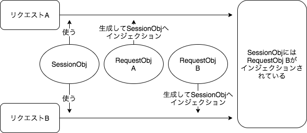
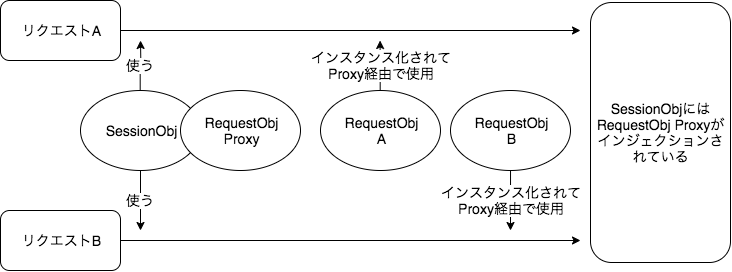

class: center, middle

# DIコンテナ入門（裏面）

うらがみの写真はNGでお願いします🙇</br>
スライドの写真はご自由にどうぞ！

---

class: center, middle

count: false

# DIコンテナ入門（裏面）

うらがみの写真はNGでお願いします🙇</br>
スライドの写真はご自由にどうぞ！

---

## 裏面とは

> りめん<br/>
> 【裏面】
> 
> 表面に対し、その裏の面。「注意事項は―参照」。物事の表に現れない、かげの面。

---

## connpassに載せた概要

裏面と題した本セッションではDIコンテナを支える技術であるバイトコードエンハンスを中心にお話します。

なお、[表面はこちら](https://jjug-cfp.cfapps.io/submissions/a5ba98a8-bad4-4122-bd61-85f89716c81e)。

裏面からもDIコンテナへ入門しましょう！

---

## connpassに載せた自己紹介

GitHub: @backpaper0

人生の本業はゼルダの伝説 ブレス オブ ザ ワイルド。合間を縫ってプログラマーをやっています。

---

## 最近の本業

.center[
<iframe width="448" height="252" src="https://www.youtube.com/embed/erkXuoYyjy8" frameborder="0" allow="accelerometer; autoplay; encrypted-media; gyroscope; picture-in-picture" allowfullscreen></iframe>
<iframe width="448" height="252" src="https://www.youtube.com/embed/4kGxOPTJIrQ" frameborder="0" allow="accelerometer; autoplay; encrypted-media; gyroscope; picture-in-picture" allowfullscreen></iframe>
]

---

## ついでの情報

- 名前：うらがみ
- 所属企業：TIS株式会社
- 2020年1月末に採用イベントやります。来てね
- DIコンテナ経験：
  - Seasar2 / CDI / Guice / HK2 / Spring

---

class: center, middle

# バイトコードエンハンス

---

## バイトコードエンハンス

バイトコードエンハンスってなに？

- バイトコード = クラスファイルの中身。JVMが読み取るコード
- エンハンス（enhance） = （能力などを）高める

---

## クラスファイルの構造

.small[
```none
ClassFile {
    u4             magic;
    u2             minor_version;
    u2             major_version;
    u2             constant_pool_count;
    cp_info        constant_pool[constant_pool_count-1];
    u2             access_flags;
    u2             this_class;
    u2             super_class;
    u2             interfaces_count;
    u2             interfaces[interfaces_count];
    u2             fields_count;
    field_info     fields[fields_count];
    u2             methods_count;
    method_info    methods[methods_count];
    u2             attributes_count;
    attribute_info attributes[attributes_count];
}
```
]

---

## クラスファイルを見てみる

```java
public class Calc {
    public int add(int a, int b) {
        return a + b;
    }
}
```

```sh
javac -g Calc.java
od -t x1 Calc.class
```

---

.small[
```none
0000000    ca  fe  ba  be  00  00  00  37  00  15  0a  00  03  00  12  07
0000020    00  13  07  00  14  01  00  06  3c  69  6e  69  74  3e  01  00
0000040    03  28  29  56  01  00  04  43  6f  64  65  01  00  0f  4c  69
0000060    6e  65  4e  75  6d  62  65  72  54  61  62  6c  65  01  00  12
0000100    4c  6f  63  61  6c  56  61  72  69  61  62  6c  65  54  61  62
0000120    6c  65  01  00  04  74  68  69  73  01  00  06  4c  43  61  6c
0000140    63  3b  01  00  03  61  64  64  01  00  05  28  49  49  29  49
0000160    01  00  01  61  01  00  01  49  01  00  01  62  01  00  0a  53
0000200    6f  75  72  63  65  46  69  6c  65  01  00  09  43  61  6c  63
0000220    2e  6a  61  76  61  0c  00  04  00  05  01  00  04  43  61  6c
0000240    63  01  00  10  6a  61  76  61  2f  6c  61  6e  67  2f  4f  62
0000260    6a  65  63  74  00  21  00  02  00  03  00  00  00  00  00  02
0000300    00  01  00  04  00  05  00  01  00  06  00  00  00  2f  00  01
0000320    00  01  00  00  00  05  2a  b7  00  01  b1  00  00  00  02  00
0000340    07  00  00  00  06  00  01  00  00  00  01  00  08  00  00  00
0000360    0c  00  01  00  00  00  05  00  09  00  0a  00  00  00  01  00
0000400    0b  00  0c  00  01  00  06  00  00  00  42  00  02  00  03  00
0000420    00  00  04  1b  1c  60  ac  00  00  00  02  00  07  00  00  00
0000440    06  00  01  00  00  00  03  00  08  00  00  00  20  00  03  00
0000460    00  00  04  00  09  00  0a  00  00  00  00  00  04  00  0d  00
0000500    0e  00  01  00  00  00  04  00  0f  00  0e  00  02  00  01  00
0000520    10  00  00  00  02  00  11
0000527
```
]

---

## クラスファイルを見てみる

さすがにきついので`javap`を使う

```sh
javap -v Calc
```

[ページに収まらないのでGistに貼り付けた](https://gist.github.com/backpaper0/eefeb6c842e4c951322224a43e2a7ec3)

---

```java
    public int add(int a, int b) {
        return a + b;
    }
```

```none
  public int add(int, int);
    descriptor: (II)I
    flags: (0x0001) ACC_PUBLIC
    Code:
      stack=2, locals=3, args_size=3
         0: iload_1
         1: iload_2
         2: iadd
         3: ireturn
      LineNumberTable:
        line 3: 0
      LocalVariableTable:
        Start  Length  Slot  Name   Signature
            0       4     0  this   LCalc;
            0       4     1     a   I
            0       4     2     b   I
```

---

## 参考資料

- [The Java Virtual Machine Specification](https://docs.oracle.com/javase/specs/jvms/se13/html/)
- [JVM入門
 -Javaプログラムが動く仕組み-](https://speakerdeck.com/sammy7th/jvmru-men-javapuroguramugadong-kushi-zu-mi)

---

## バイトコードをエンハンスする方法

- バイトコードはクラスローダーでロードされる
- バイトコードエンハンスはバイトコードを動的に書き出してクラスローダーにロードさせる技術
- DIコンテナは既にあるバイトコードを改変するのではなくサブクラスを書き出す方式が多い（それに対してJMockitはInstrumentation APIを使用して既にあるバイトコードを改変する）
- Javaは静的型付言語なのに動的にバイトコードを弄るので「黒魔術」と表現されたりする
- Springでバイトコードエンハンスをする方法はいくつかあるっぽい
- ここでは`MethodInterceptor`を使う方法を紹介

---

## インターセプターのinterface

```java
public interface MethodInterceptor extends Interceptor {

	Object invoke(MethodInvocation invocation) throws Throwable;
}
```

```java
public interface Interceptor extends Advice {
}
```

```java
public interface Advice {
}
```

---

## インターセプターを実装する

```java
public class LoggingInterceptor implements MethodInterceptor {
    public Object invoke(MethodInvocation inv) throws Throwable {
        System.out.printf("begin: %s%n", inv.getMethod());
        Object ret = inv.proceed();
        System.out.printf("end: %s%n", inv.getMethod());
        return ret;
    }
}
```

```java
@Retention(RetentionPolicy.RUNTIME)
public @interface WithLogging {
}
```

---

## いくつかbean登録する

```java
    @Bean
    public BeanPostProcessor autoProxyCreator() {
        return new DefaultAdvisorAutoProxyCreator();
    }

    @Bean
    public Advisor advisor() {
        var a = new DefaultPointcutAdvisor();
        a.setAdvice(new LoggingInterceptor());
        a.setPointcut(AnnotationMatchingPointcut
                .forMethodAnnotation(WithLogging.class));
        return a;
    }
```

---

## インターセプターを適用する

```java
@Component
public class Hello {
    @WithLogging
    public void say() {
        System.out.println("hello world");
    }
}
```

```none
begin: public void com.example.Hello.say()
hello world
end: public void com.example.Hello.say()
```

---

## インターセプターの適用イメージ

```java
class HelloEnhance extends Hello {
    private MethodInterceptor i = new LoggingInterceptor();
    public void say() {
        var inv = new MethodInvocation() {
            public Object proceed() {
                HelloEnhance.super.say();
                return null;
            }
        };
        i.invoke(inv);
    }
}
```

---

## エンハンスされたバイトコードを見るには

`org.springframework.cglib.core.AbstractClassGenerator`の`generate`メソッドでエンハンスしたバイトコードを`byte[]`形式で得ているのでデバッグしてファイルに落として`javap`すると良い

---

class: center, middle

# スコープとProxy

---

## 異なるスコープをインジェクション

```java
public class SessionObj {
    @Inject
    private RequestObj ro;
    public void action() {
        ro.process();
    }
}

public class RequestObj {
    //フィールドやメソッドの定義は省略
}
```

---

## 処理の流れ（イメージ）

1. HTTPリクエストを受け取る
1. セッションを作成する
1. `SessionObj`のインスタンスを作成する
1. `RequestObj`のインスタンスを作成する
1. `SessionObj`に`RequestObj`をインジェクションする
1. `SessionObj`の`action`メソッドを実行する
1. `RequestObj`の`process`メソッドを実行する
1. HTTPリクエストが終了する
1. `RequestObj`のインスタンスをDIコンテナから破棄する
1. HTTPレスポンスを返す

---

## 疑問

何も問題はなさそう

では、2つのリクエストがほぼ同時に来た場合はどうなるのか？

---

## 処理の流れ（イメージ）

1. HTTPリクエストAを受け取る
1. セッションを作成する
1. `SessionObj`のインスタンスを作成する
1. `RequestObj`のインスタンスを作成する
1. `SessionObj`に`RequestObj`をインジェクションする
1. `SessionObj`の`action`メソッドを実行する
1. `RequestObj`の`process`メソッドを実行し始める
1. HTTPリクエストBを受け取る
1. `RequestObj`のインスタンスを作成する
1. `SessionObj`に`RequestObj`をインジェクションする……！？

---

## 処理の流れ（イメージ）



---

## インジェクションがかち合う！？

`SessionObj`へインジェクションされる`RequestObj`がかち合う

Seasar2を使っていた人はわかると思うけれど、こういった問題があるため自身よりも狭いスコープのコンポーネントをインジェクションできなかった

SpringやCDIはバイトコードエンハンスによってこれを解決する

---

## Proxy

SpringやCDIでは、バイトコードエンハンスによって生成するサブクラスが元のクラスをラップするような構成を取る

Springでは`ProxyFactory`によってクラスを生成する

CDIではClient proxyと呼ばれるクラスが生成される

---

## 単なるサブクラスのイメージ

```java
public class HelloSubclass extends Hello {
    public void say() {
        super.say();
    }
}
```

Seasar2はこの形式

---

## Proxyのイメージ

```java
public class HelloProxy extends Hello {
    private BeanFactory beanFactory;
    public void say() {
        Hello instance = beanFactory.getBean(Hello.class);
        instance.say();
    }
}
```

SpringやCDIはこの形式

---

## Proxyのメリット

メソッドを呼び出す時にコンテナからコンポーネントを取得するのでスコープが異なる場合の依存関係を気にする必要がなくなる

---

## 再掲

```java
public class SessionObj {
    @Inject
    private RequestObj ro;
    public void action() {
        ro.process();
    }
}

public class RequestObj {
    //フィールドやメソッドの定義は省略
}
```

---

## 処理の流れ（イメージ）

1. HTTPリクエストAを受け取る
1. セッションを作成する
1. `SessionObj`のインスタンスを作成する
1. `SessionObj`に`RequestObj`をインジェクションする
1. `SessionObj`の`action`メソッドを実行する
1. `RequestObj`のインスタンスを作成する
1. コンテナから取得した`RequestObj`の`process`メソッドを実行し始める
1. HTTPリクエストBを受け取る
1. `SessionObj`の`action`メソッドを実行する
1. `RequestObj`のインスタンスを作成する
1. コンテナから取得した`RequestObj`の`process`メソッドを実行し始める

---

## 処理の流れ（イメージ）



---

## コンストラクタインジェクションに関する疑問

次のようなコンストラクタインジェクションをしているクラスがあるとする

```java
public class Foo {
    private Bar bar;
    public Foo(Bar bar) {
        this.bar = Objects.requireNonNull(bar);
    }
    public void doFoo() {
        bar.doBar();
    }
}
```

---

## Proxyのイメージ

Proxyは次のようになる

```java
public class FooProxy extends Foo {
    private BeanFactory beanFactory;
    public FooProxy(Bar bar) {
        super(bar);
    }
    public void doFoo() {
        Foo foo = beanFactory.getBean(Foo.class);
        foo.doFoo();
    }
}
```

このProxyをインスタンス化する場合、`bar`には何を渡せば良いのだろうか？

---

## コンストラクタへ何を渡すか？

`Bar`のProxy → Proxyを作らないコンポーネントもある

`null` → `Bar`で`null`チェックをしている

マジで何を渡せばいいのかわからない……

とても気になって調べた

---

## 答え

実は「何も渡さない」が正解

もっと言うと「Proxyのコンストラクタは呼ばれない」

信じ難いかもしれないけれどProxyはコンストラクタを呼ばずにインスタンス化される

---

## インスタンス化の秘密

Javaの仕様的にコンストラクタを呼ばずにインスタンス化できるものがある

それはデシリアライズ

バイト配列からデシリアライズでインスタンスを復元する時、コンストラクタは呼ばれない

---

## デシリアライズを試す

```java
class Obj implements Serializable {
    public Obj() {
        System.out.println("new Obj()");
        System.out.println(this);
    }
}
```

---

## デシリアライズを試す

```java
public static void main(final String[] args) throws Exception {
    var obj1 = new Obj();

    System.out.println("Serialize");
    var baos = new ByteArrayOutputStream();
    var oos = new ObjectOutputStream(baos);
    oos.writeObject(obj1);

    System.out.println("Deserialize");
    var bs = baos.toByteArray();
    var bais = new ByteArrayInputStream(bs);
    var ois = new ObjectInputStream(bais);
    var obj2 = (Obj) ois.readObject();

    System.out.println(obj1);
    System.out.println(obj2);
}
```

---

## デシリアライズを試す

```none
new Obj()
com.example.Obj@1e81f4dc
Serialize
Deserialize
com.example.Obj@1e81f4dc
com.example.Obj@17d99928
```

---

## デシリアライズを利用してインスタンス化

SpringはObjenesisというライブラリを使用してProxyをインスタンス化している

Objenesisはクラスをインスタンス化するためのライブラリ

典型的な使用例としてProxyが挙げられている

---

## Objenesis

[SunReflectionFactoryInstantiator](https://github.com/easymock/objenesis/blob/3.1/main/src/main/java/org/objenesis/instantiator/sun/SunReflectionFactoryInstantiator.java)

> Instantiates an object, WITHOUT calling it's constructor, using internal
> sun.reflect.ReflectionFactory - a class only available on JDK's that use Sun's 1.4 (or later)
> Java implementation. This is the best way to instantiate an object without any side effects
> caused by the constructor - however it is not available on every platform.

---

class: center, middle

# まとめ

---

## まとめ

- バイトコードとはクラスファイルの中身を指す
- バイトコードエンハンスとは動的にバイトコードを書き出す技術（Seasar2由来な気がする。あまり一般的な言葉ではないかも）
- DIコンテナが持つ機能のいくつかはバイトコードエンハンスの上に成り立っている
- モダンなDIコンテナはProxyによってスコープを気にすることなくインジェクションできる

このように裏面を覗き込むと面白い世界が広がっている

是非とも裏面まで楽しもう！

