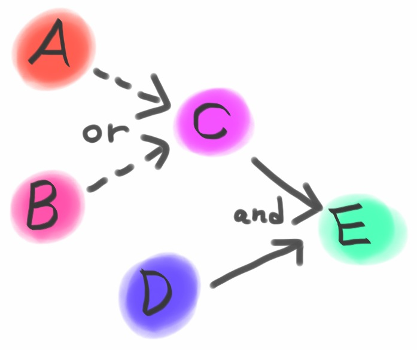

## Concurrency Utilities in Java 8

[@backpaper0](https://twitter.com/backpaper0)

2014-07-12 [#kanjava](http://connpass.com/event/6786/)


### Toc

* `CompletionStage/CompletableFuture`
* `StampedLock`
* `CountedCompleter`


## CompletionStage/CompletableFuture

アクションの完了をトリガーに次のアクションを行うという流れをメソッドチェーンで書けるもの。


### 例

Aが完了したらBを起動する


### Java 7での実装例(1)

Aの完了を待機してBを起動する。

```java
ExecutorService executor = ...

Future<T> futureA = executor.submit(() -> ... );

T resultA = futureA.get(); //ブロック

Future<T> futureB = executor.submit(() -> ... );
```


### Java 7での実装例(2)

Aの最後でBを起動する。

```java
ExecutorService executor = ...

Future<T> futureA = executor.submit(() -> {
    ...

    Future<T> futureB = executor.submit(() -> ... );
});
```


### Java 7での実装例の問題点

* (1)ではスレッドをブロックする
* (2)ではAがBを含んでいる


### CompletableFutureでの実装例

```java
CompletableFuture<T> futureA = CompletableFuture.supplyAsync(() -> ... );

CompletableFuture<T> futureB = futureA.thenApply(a -> ... );
```


### 少し複雑な例

* Aを起動する
* Bを起動する
* AまたはBのどちらかが完了したらCを起動する
* Dを起動する
* CとDの両方共が完了したらEを起動する


### 図




### Java 7での実装例

```java
ExecutorService exec = ...
CountDownLatch cdl = new CountDownLatch(1);
AtomicReference<T> ref = new AtomicReference<>();

Future<?> futureA = exec.submit(() -> {
    T a = ...
    ref.compareAndSet(null, a);
    cdl.countDown();
});

Future<?> futureB = exec.submit(() -> {
    T b = ...
    ref.compareAndSet(null, b);
    cdl.countDown();
});

Future<T> futureC = exec.submit(() -> {
    cdl.await(); //ブロック
    T ab = ref.get();
    ...
});

Future<T> futureD = exec.submit(() -> ... );

Future<T> futureE = exec.submit(() -> {
    T c = futureC.get(); //ブロック
    T d = futureD.get(); //ブロック
    ...
});
```


### CompletableFutureでの実装例

```java
CompletionStage<T> futureA = CompletableFuture.supplyAsync(() -> ... );

CompletionStage<T> futureB = CompletableFuture.supplyAsync(() -> ... );

CompletionStage<T> futureC = futureA.applyToEitherAsync(futureB, ab -> ... );

CompletionStage<T> futureD = CompletableFuture.supplyAsync(() -> ... );

CompletionStage<T> futureE = futureC.thenCombineAsync(futureD, (a, b) -> ... );
```


CompletionStageは完了や例外をトリガーとして後続のアクションを実行する。


### トリガー

* ステージが正常に完了した( A )
* ふたつのステージの内どちらかが正常に完了した( B )
* ふたつのステージが両方とも正常に完了した( C )
* ステージが正常に完了または例外を投げた( D )
* ステージが例外を投げた( E )


### アクション

* 引数を受けとって値を返す( `T -> U` )
* 引数を受けとって処理する( `T -> void` )
* 処理を行う( `() -> void` )


 |`T -> U`     |`T -> void`   |`() -> void`  |`(T,CompletionStage) -> T`
-|-------------|--------------|--------------|--------------------------
A|thenApply    |thenAccept    |thenRun       |thenCompose
B|applyToEither|acceptEither  |runAfterEither|
C|thenCombine  |thenAcceptBoth|runAfterBoth  |
D|handle       |whenComplete  |              |
E|exceptionally|              |              |


```java
CompletableFuture future = ...
CompletableFuture other = ...

//ステージが正常に完了した( A )
future.thenApply(t -> ... );

//ふたつのステージの内どちらかが正常に完了した( B )
future.applyToEither(other, t -> ... );

//ふたつのステージが両方とも正常に完了した( C )
future.thenCombine(other, (t, u) -> ... );

//ステージが正常に完了または例外を投げた( D )
future.handle((t, e) -> ... );

//ステージが例外を投げた( E )
future.exceptionally(e -> ... );
```


また、各操作にはそれぞれ

* デフォルトの実行
* 非同期実行( `ForkJoinPool#commonPool()` )
* `Executor` を指定できるカスタム実行

の3メソッドが定義されている。


```java
CompletableFuture<T> future = ...

//デフォルトの実行
future.thenApply(t -> ...);

//非同期実行(メソッド名のsuffixが Async)
future.thenApplyAsync(t -> ...);

//Executorを指定(メソッド名のsuffixが Async で Executor を渡せる)
future.thenApplyAsync(t -> { ... }, executor);
```


### CompletableFutureインスタンスの生成

`CompletableFuture` のstaticメソッドを利用する。

```java
//値をセットした完了済みのCompletableFuture
CompletableFuture<T> future = CompletableFuture.completedFuture(t);

//アクションを非同期で実行するCompletableFuture
CompletableFuture<Void> future = CompletableFuture.runAsync(() -> { ... });

//アクションを非同期で実行して結果をセットするCompletableFuture
CompletableFuture<T> future = CompletableFuture.supplyAsync(() -> t);
```

`runAsync` と `supplyAsync` は `Executor` を渡すメソッドもある。


CompletableFutureは、

* ひとつのアクションは小さくする
* スレッドをブロックしない
* シングルスレッドでも動作するように書く

と良いと思われます。

※個人の感想です


## StampedLock

読取り・書込みロックに加えて楽観排他が行えるロック。


### ReadWriteLockの読取りロック

```java
ReadWriteLock rwl = new ReentrantReadWriteLock();

Lock r = rwl.readLock();
r.lock();
try {
    ...

} finally {
    r.unlock();

}
```


### StampedLockの読取りロック

```java
StampedLock sl = new StampedLock();

long stamp = sl.readLock();
try {
    ...

} finally {
    sl.unlockRead(stamp);

}
```


### その他のStampedLockの機能

* 楽観排他
* 読取ロック/書込みロック/楽観排他の相互変換


### 楽観排他

1. `tryOptimisticRead` メソッドでスタンプを取得する
2. 何かしら処理を行う
3. `validate` メソッドで他にロック取得が無かったかチェックする
4. ロック取得されていた場合は読取りロックを取得して再度処理を行う


### 例

```java
StampedLock sl = new StampedLock();

long stamp = sl.tryOptimisticRead();
if (stamp != 0L) {
    ...
}

if (sl.validate(stamp) == false) {

    long readStamp = sl.readLock();
    try {
        ...

    } finally {
        sl.unlockRead(readStamp);

    }
}
```


### ロックの変換

```java
long stamp = sl.tryOptimisticRead();

//読取りロックへ変換
stamp = sl.tryConvertToReadLock(stamp);

//書込みロックへ変換
stamp = sl.tryConvertToWriteLock(stamp);

//楽観排他へ変換
stamp = sl.tryConvertToOptimisticRead(stamp);
```


### 注意点

* スタンプは一年以上経つと一周する事があるらしい
* `Serializable` 実装しているが常にロック解除状態でデシリアライズされる


## CountedCompleter

保留中のアクションが無い場合に完了をハンドリングできる `ForkJoinTask` 。


* `RecursiveAction` のように `compute` メソッドに処理を書く
* ただし `fork` した子タスクの終了を `join` で待つのではなく `onCompletion` メソッドでハンドリングする


### 例

```java
public class MapReducer<T> extends CountedCompleter<T> {

    private final List<T> list;

    private final int low;

    private final int high;

    private final UnaryOperator<T> mapper;

    private final BinaryOperator<T> reducer;

    private MapReducer<T> sibling;

    private T result;

    public MapReducer(MapReducer<T> parent, List<T> list, int low,
            int high, UnaryOperator<T> mapper, BinaryOperator<T> reducer) {
        super(parent);
        this.list = list;
        this.low = low;
        this.high = high;
        this.mapper = mapper;
        this.reducer = reducer;
    }

    @Override
    public void compute() {
        if (high - low > 1) {
            int mid = (low + high) / 2;

            MapReducer<T> left = new MapReducer<>(this, list, low, mid,
                    mapper, reducer);
            MapReducer<T> right = new MapReducer<>(this, list, mid, high,
                    mapper, reducer);

            left.sibling = right;
            right.sibling = left;

            //保留アクションの数をセットする
            setPendingCount(2);

            left.fork();
            right.fork();

        } else if (low < high) {
            T element = list.get(low);
            result = mapper.apply(element);
        }

        //保留アクション数が1以上なら1減らす
        //0ならonCompletionを実行する
        tryComplete();
    }

    @Override
    public void onCompletion(CountedCompleter<?> caller) {
        if (this != caller) {
            MapReducer<T> child = (MapReducer<T>) caller;
            MapReducer<T> sibling = child.sibling;
            if (sibling != null && sibling.result != null) {
                result = reducer.apply(child.result, sibling.result);
            } else {
                result = child.result;
            }
        }
    }

    @Override
    public T getRawResult() {
        return result;
    }

    public static <T> T mapReduce(List<T> list, UnaryOperator<T> mapper,
            BinaryOperator<T> reducer) {
        return new MapReducer<>(null, list, 0, list.size(), mapper, reducer)
                .invoke();
    }
}
```


* 他の `ForkJoinTask` と比較しようとしたけどよく分からない
* というか解説するほど学べてないので誰か学んで教えてください


並行処理は楽しいけど難しい。


## ☃

おわり。
