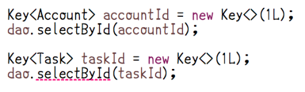
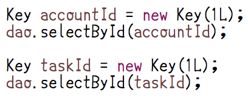

class: center, middle

# ドメインクラスの話

---

### ドメインクラスとは

* Domaで扱える値オブジェクト
* `String`や`Integer`などの基本型だらけになりがちなカラムのマッピングに値オブジェクトが使える
* 「ドメイン」と冠しているけどDDDとは無関係

---

class: center, middle

## 一般的な話

---

### 引数の型

部門IDとロールでユーザーを検索する。

```java
String deptId = ...
String role = ...
List<User> users = dao.findBy(deptId, role);
```

---

### 値クラスを使わなかったら

引数の順番を間違えてもコンパイルエラーにならない。

```java
String deptId = ...
String role = ...
List<User> users = dao.findBy(role, deptId);
```

実行時エラーにもならず気付きにくい😰

---

### 値クラスを使ったら

部門IDとロールを異なるドメインクラスにすると……

```java
DepartmentId deptId = ...
UserRole role = ...
List<User> users = dao.findBy(deptId, role);
```

---

### 値クラスを使ったら

引数の順番を間違えたらコンパイルエラーになる。

```java
DepartmentId deptId = ...
UserRole role = ...
List<User> users = dao.findBy(role, deptId);
```

実装中にすぐに気がつく😉

---

### 値の導出

住所から市区町村を取得する。

```java
String address = ...
String city = ...
```

---

### 値クラスを使わなかったら

文字列をごにょごにょしたり😧

```java
String address = ...
String city = address.split(" ")[1];
```

---

### 値クラスを使わなかったら

ユーティリティを作ったり😨

```java
String address = ...
String city = AddressUtil.extractCity(address);
```

---

### 値クラスを使わなかったら

でも全部`String`だから……😭

```java
String anotherCity = ...
String city = AddressUtil.extractCity(anotherCity);
```

---

### 値クラスを使ったら

住所そのものに導出メソッドを持たせられる😎

```java
Address address = ...
City city = address.getCity();
```

```java
public class Address {

    public City getCity() { ... }

    ...
}
```

---

### 値クラスの他のメリット

* 引数や戻り値に使っていればシグネチャに現れる
* Javadocや変数名を見なくてもメソッドの把握がしやすい
* デバッグ情報無しにコンパイルされて`method(String arg0, String arg)`とかになってると悲惨
* IDEの補完
* 型で候補が絞られて素早く補完できる

---

### 基本型の特徴

* 抽象度が高くて汎用的
* 具体的な型で会話する方が良い場合がある
* そういう意味で言うと、リストも？
* でもコンテナ系の型は抽象度が高い方が使いやすい気がする
* (この辺、もっとちゃんと言語化したい)

---

### データの流れ

ブラウザ  
⇅  
Webフレームワーク  
⇅  
アプリケーション  
⇅  
DBフレームワーク  
⇅  
データベース

---

### 値クラスと基本型の境界

ブラウザ  
⇅  
**Webフレームワーク**👈  
⇅  
アプリケーション  
⇅  
**DBフレームワーク**👈  
⇅  
データベース

---

### 値クラスだけで会話をすべき場所

ブラウザ  
⇅  
Webフレームワーク  
⇅  
**アプリケーション**👈  
⇅  
DBフレームワーク  
⇅  
データベース

---

### ドメインクラスの作り方(再掲)

* `@Domain`で注釈して`valueType`要素に基本型を指定する

```java
@Domain(valueType = String.class)
public class Foo {
    private final String value;
    public Foo(String value) {
        this.value = Objects.requireNonNull(value);
    }
    public String getValue() {
        return value;
    }
}
```

---

### ドメインクラスを使う

エンティティのフィールドで。

```java
@Entity
public class Hoge {

    public Foo foo;

    ...
}
```

---

### ドメインクラスを使う

DAOメソッドの引数で。

```java
@Select
List<Hoge> select(Foo foo);
```

---

### ドメインクラスを使う

DAOメソッドの戻り値で。

```java
@Select
List<Foo> select();
```

---

### 個人的には

基本型は使わず、全てドメインクラスを使います

---

class: center, middle

## ジェネリックなドメインクラス

---

### ジェネリックなドメインクラスの活用

* ドメインクラスは型引数を取ることができる

```java
@Domain(valueType = Long.class)
public class Key<ENTITY> {
    private final Long value;
    public Key(Long value) { this.value = value; }
    public Long getValue() { return value; }
}
```

型引数はドメインクラス内ではまったく使用されないが……

---

### `Dao` のメソッドの引数で役立つ 

```java
@Select
Account selectById(Key<Account> id);
```

* このメソッドに渡せるのは `Key<Account>` だけ
* `Key<Task>` や `Key<Project>` のように異なる型引数を取る `Key` を渡そうとするとコンパイルエラーとなる



---

### ジェネリックなドメインクラスを使わないと

```java
@Select
Account selectById(Key id);
```

コンパイルエラーで検出できない



---

class: center, middle

## インターフェースなドメインクラス

---

### インターフェースなドメインクラスの活用

* ドメインクラスはインターフェースにもできる
* その場合はコンストラクタが使えないのでstaticファクトリーメソッドを用意する

```java
@Domain(valueType = String.class,
        factoryMethod = "valueOf")
public interface Color {

    String getValue();

    static Color valueOf(String value) {
        return new ColorImpl(value);
    }
}
```

---

### 使いどころ

決まった値があるけど自由入力も許すという場合に便利

```java
//定義済みの色を表現する
public enum DefinedColor implements Color {
    RED, BLUE, GREEN;
    public String getValue() { return name(); }
}

//#f90c76 のような16進数表現をする
public class ColorImpl implements Color {
    private final String value;
    public ColorImpl(String value) { this.value = value; }
    public String getValue() { return value; }
}
```

---

### `Color.valueOf`の実装例

```java
static Color valueOf(String value) {
    //定義済みの色があればDefinedColorを返す
    //なければColorImplを返す
    return Arrays.stream(DefinedColor.values())
            .filter(c -> value.equals(c.getValue()))
            .findFirst()
            .map(Color.class::cast)
            .orElseGet(() -> new ColorImpl(value));
}
```

---

class: center, middle

## ドメインクラスと曖昧な状態

---

### 前方一致の検索条件をドメインクラスで扱う

* 画面で入力された値をもとに前方一致検索を行う
* 業務アプリでよくある感じの仕様

---

### ドメインクラスを普通に使うと

曖昧な状態を許容しなくてはいけない


```java
//前方一致の検索条件なのでbackpaper0@gmail.comではなく
//backpapみたいな曖昧な状態を許容せざるをえない
@GET
public Response search(
    @QueryParam("email") EmailAddress condition) { ... }
```

---

### 制約を守る

* ドメインクラスは制約を守って使うべき
* 曖昧な状態を許すとドメインクラスを使う場面で不安になる

---

### ドメインクラスを使わないと

型を `String` などの基本型にすると型からはメールアドレスなのかそれ以外の項目なのかが分からなくなる

```java
@GET
public Response search(
    @QueryParam("email") String condition) { ... }
```

※型は大切にしましょう

---

### そこで……

前方一致の検索条件を表すドメインクラスを導入してみる

```java
@Domain(valueType = String.class)
public class PartOf<T> {
    private final String value;
    public PartOf(String value) { this.value = value; }
    public String getValue() { return value; }
}
```

このようなドメインクラスを作って……

---

### 前方一致条件のドメインクラス

こう使う

```java
@GET
public Response search(
    @QueryParam("email") PartOf<EmailAddress> condition) {
        ...
}
```

型変数にドメインクラスをバインドすることで「メールアドレスの一部」ということを型で表現

---

class: center, middle

## ExpressionFunctionsの拡張

---

### @prefixなどでドメインクラスを使おうとすると

`ExpressionFunctions.prefix`の引数は`String`型だから。

```sql
SELECT /*%expand*/*
  FROM Hoge
//コンパイルエラーになる
 WHERE foo LIKE /* @prefix(foo) */'x'
```

---

### かといって

`value`フィールドにアクセスするのは……

```sql
SELECT /*%expand*/*
  FROM Hoge
//内部の露呈
 WHERE foo LIKE /* @prefix(foo.value) */'x'
```

---

### そこで

`ExpressionFunctions`を拡張します。

```java
public class MyExpressionFunctions
        extends StandardExpressionFunctions {

    //Fooを引数にとるprefixメソッドを定義する
    public String prefix(Foo foo) {
        if (foo != null) {
            return super.prefix(foo.getValue());
        }
        return null;
    }
}
```

---

### コンパイル時の注釈処理オプションで指定する


```sh
javac -Adoma.expr.functions=MyExpressionFunctions ...
```

これでドメインクラスに対して`@prefix`できる。

```sql
SELECT /*%expand*/*
  FROM Hoge
 WHERE foo LIKE /* @prefix(foo) */'x'
```

---

### @prefixを使いたいドメインクラスが多い場合

* `StringDomain`的な`interface`を導入する
* あるいは、`prefix`メソッドは自動生成してしまうとか

---

### StringDomainの例

こんな`interface`を作って、

```java
public interface StringDomain {
    String getValue();
}
```

---

### StringDomainの例

ドメインクラスで`implements`して、

```java
@Domain(valueType = String.class)
public class Foo implements StringDomain {
    ...

    @Override
    public String getValue() { ... }
}
```

---

### StringDomainの例

`ExpressionFunctions`では`StringDomain`に対する`prefix`メソッドを定義する。

```java
public class MyExpressionFunctions
        extends StandardExpressionFunctions {

    public String prefix(StringDomain s) {
        if (s != null) {
            return super.prefix(s.getValue());
        }
        return null;
    }
}
```

---

class: center, middle

## 何も考えなくても失敗しにくいドメインクラスの使い方

---

### 何も考えなくても失敗しにくいドメインクラスの使い方

* 業務に出てくる名詞はとにかくドメインクラス
* 自動生成 + ジェネレーションギャップパターン
* `getValue`は明示的には使わないようにする(`value`は内部状態)

---

### `getValue`は明示的には使わない

* `value`は内部状態
* せっかくの値オブジェクトを基本型として扱う事に

```java
Money a = ...
Money b = ...
Money c = new Money(a.getValue() + b.getValue());
```

👆ではなく、👇のようにすべき。

```java
Money a = ...
Money b = ...
Money c = a.add(b);
```

---

class: center, middle

## まとめ

---

### まとめ

* 型最高
--

* 値クラス最高
--

* JDBCでシームレスに値クラスを使えるDoma最高

---

## この資料について

* Author: [@backpaper0](https://github.com/backpaper0)
* License:  [The MIT License](https://opensource.org/licenses/MIT)

