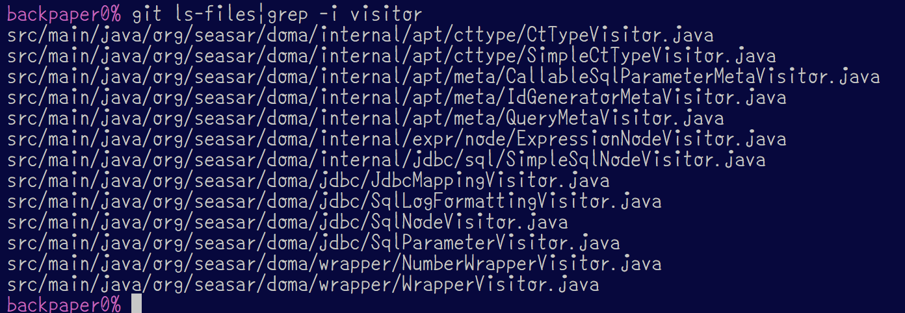

class: center, middle

# Domaソースコード<br/>リーディングの勘所(仮)

---

### 自己紹介

* @backpaper0 うらがみ⛄️
* 大阪でSIerをしているJavaプログラマ
* Domaヘビーユーザー・アーリーアダプター
* 2010年からDomaを使い続けている

---

### 今日話すこと

* トップダウンで読み進める
* パッケージ構成を俯瞰する
* Visitorパターン

---

### 今日話さないこと

.image[
]

https://qiita.com/backpaper0@github/items/3557beac39d6e7e9c93a

---

class: center, middle

## トップダウンで読み進める

---

### トップダウンで読み進める

処理の開始から順番に読んで行く(素直に読める)

IDEでデバッグ実行しながら読むのも有効

---

### Domaのエントリーポイント

Domaの操作はDaoを介して行われる

Daoのメソッドを呼ぶところから読み進めると良い

---

### こんなDaoメソッドは……

```java
@Dao
public interface BookDao {

  @Select
  Optional<Book> selectByIsbn(Isbn isbn);
}
```

---

### こういう実装になる

```java
public Optional<Book> selectByIsbn(Isbn isbn) {
  //ロギングとtry-catch省略
  SqlFileSelectQuery __query = getQueryImplementors().createSqlFileSelectQuery(__method0);
  //queryへの色々とセットするコード省略
  __query.prepare();
  SelectCommand<Optional<Book>> __command = getCommandImplementors().createSelectCommand(/* 省略 */);
  Optional<Book> __result = __command.execute();
  __query.complete();
  return __result;
}
```

---

### Daoメソッドの流れ

* `Query`をインスタンス化(`QueryImplementors`でカスタマイズ可能)
* `Query`に色々とセットする
* `Query.prepare`を実行
* `Command`をインスタンス化(`CommandImplementors`でカスタマイズ可能)
* `Command.execute`を実行
* `Query.complete`を実行
* 値を返す

SELECT系もINSERT系もだいたい一緒

---

### Query.prepareでやること

SELECT系の場合

* `SelectOptions`の内容を`Query`にセット
* SQLファイルの読み込み、パース

---

### Command.executeでやること

SELECT系の場合

* `Config`から取得した`DataSource`から`Connection`を取得して`PreparedStatement`を作って`executeQuery`
* `ResultSetHandler`で`ResultSet`をエンティティなどに加工する

---

### トップダウンで読む話は以上

ここまでで質問とか？

---

class: center, middle

## パッケージ構成を俯瞰する

---

### パッケージ構成を俯瞰する

パッケージ毎に格納されているクラスをざっくり眺める

パッケージ名、クラス名から役割を推測

実装をながめて確認

---

### Domaのパッケージ構成

* `org.seasar.doma`
* `org.seasar.doma.expr`
* `org.seasar.doma.internal`
* `org.seasar.doma.jdbc`
* `org.seasar.doma.message`
* `org.seasar.doma.wrapper`

---

### Domaのパッケージ構成(jdbc)

* `org.seasar.doma.jdbc.builder`
* `org.seasar.doma.jdbc.command`
* `org.seasar.doma.jdbc.dialect`
* `org.seasar.doma.jdbc.domain`
* `org.seasar.doma.jdbc.entity`
* `org.seasar.doma.jdbc.id`
* `org.seasar.doma.jdbc.query`
* `org.seasar.doma.jdbc.tx`
* `org.seasar.doma.jdbc.type`

---

### Domaのパッケージ構成(internal)

* `org.seasar.doma.internal.apt`
* `org.seasar.doma.internal.expr`
* `org.seasar.doma.internal.jdbc`
* `org.seasar.doma.internal.message`
* `org.seasar.doma.internal.util`

---

### org.seasar.doma

ルートパッケージ

`@Entity`とか`@Dao`、`@Select`、`@Domain`などよく使うアノテーションがある

---

### org.seasar.doma.expr

`ExpressionFunctions`インターフェースのみ

---

### org.seasar.doma.message

エラーメッセージ

---

### org.seasar.doma.wrapper

基本型を統一的に扱うためのラッパー

---

### org.seasar.doma.jdbc

`Config`や`JdbcLogger`、`SqlFileRepository`など

---

### org.seasar.doma.jdbc.builder

`SelectBuilder`や`InsertBuilder`など

動的クエリを組み立てるもの

あまり使わない方が良い

---

### org.seasar.doma.jdbc.command

`SelectCommand`や`InsertCommand`など

`CommandImplementors`が返すクラス

`Connection`の取得から`Statement`の実行を行う

---

### org.seasar.doma.jdbc.dialect

`Dialect`インターフェースといくつかのRDBMS対応の`Dialect`実装がある

`Dialect`はページネーションや悲観排他のときにRDBMSの方言を吸収してくれるもの

---

### org.seasar.doma.jdbc.domain

外部ドメイン用の`DomainConverter`や、`DomainType`がある

`DomainType`はドメインクラスをコンパイルするときに自動生成される補助クラスの基底インターフェース

補助クラスはアンダースコア + ドメインクラス名で生成される(例えば`Isbn`というドメインクラスなら補助クラスは`_Isbn`)

---

### org.seasar.doma.jdbc.entity

`EntityListener`や`EntityType`、`EntityPropertyType`がある

`EntityType`はエンティティをコンパイルするときに自動生成される補助クラスの基底インターフェース

補助クラスはアンダースコア + エンティティ名で生成される(例えば`Book`というエンティティなら補助クラスは`_Book`)

`EntityPropertyType`実装クラスは自動生成されない

---

### org.seasar.doma.jdbc.id

`@Id`を付けたフィールドの値の生成に関するインターフェースがある

---

### org.seasar.doma.jdbc.query

`SqlFileSelectQuery`や`AutoInsertQuery`など

`QueryImplementors`が返すクラス

クエリの組み立てを行う

---

### org.seasar.doma.jdbc.tx

ローカルトランザクションに関するクラスがある

---

### org.seasar.doma.jdbc.type

JDBCのインターフェースで基本型を統一的に扱うためのインターフェース

`ResultSet.getXxx`や`PreparedStatement.setXxx`を呼び出す

---

### org.seasar.doma.internal

これより先はDomaが内部だけで使いたいもの

我々ユーザーは使ってはいけない(Doma 3になるとJava 9対応が入るので本当に使えなくなるはず)

でもソースコードを読むのは自由

---

### org.seasar.doma.internal.apt

注釈処理に関するクラス

`EntityProcessor`や`DaoProcessor`などがエントリーポイント

`XxxMetaFactory`で対象の情報を集めて、`XxxGenerator`でソースコードを生成するという流れ

---

### org.seasar.doma.internal.expr

SQLファイル内の`/*% if ... */`などで使える式言語のASTやパーサー、評価器などがある

---

### org.seasar.doma.internal.jdbc

さらにこの下にいくつかのパッケージに別れている

`org.seasar.doma.jdbc`パッケージの補助的なクラスがある

2 Way SQLのパーサーもこの辺にある

---

### org.seasar.doma.internal.message

`org.seasar.doma.message`の補助的なクラスがある

---

### org.seasar.doma.internal.util

みんな大好きな`XxxUtil`がある

---

### Domaのパッケージ俯瞰は以上

ここまでで質問とか？

---

class: center, middle

## Visitorパターン

---

### Visitorパターンとは

GoFのデザインパターンの1つ

データと処理を分離するのが目的

数あるデザインパターンの中でも理解が難しいものだと思う

DomaではVisitorパターンをめっちゃ使っている

---

### Domaに存在するXxxVisitor

.image[
]

---

### データの例

```java
interface Node {}

class Select implements Node {
  From from;
  Where where;
  OrderBy orderby;
}

class From implements Node { String table; }

class Where implements Node { List<String> conditions; }

class OrderBy implements Node { List<String> columns; }
```

---

### Visitorパターンを使わない例

```java
class Select implements Node {
  String buildQuery() {
    return "select *" + from.buildQuery()
      + where.buildQuery() + orderBy.buildQuery();
  }
}

class From implements Node {
  String buildQuery() {
    return " " + table;
  }
}
```

---

### Visitorパターンを使わない例

```java
class Where implements Node {
  String buildQuery() {
    return " " + conditions.stream()
      .collect(joining(" and "));
  }
}

class OrderBy implements Node {
  String buildQuery() {
    return " " + columns.stream()
      .collect(joining(", "));
  }
}
```

---

### Visitorパターンを使う例

```java
interface Visitor {
  String visit(Select select);
  String visit(From from);
  String visit(Where where);
  String visit(OrderBy orderBy);
}

interface Node {
  String accept(Visitor visitor);
}
```

---

### Visitorパターンを使う例

```java
class Select implements Node {
  String accept(Visitor visitor) {
    return visitor.visit(this);
  }
}

class From implements Node {
  String accept(Visitor visitor) {
    return visitor.visit(this);
  }
}
```

---

### Visitorパターンを使う例

```java
class Where implements Node {
  String accept(Visitor visitor) {
    return visitor.visit(this);
  }
}

class OrderBy implements Node {
  String accept(Visitor visitor) {
    return visitor.visit(this);
  }
}
```

---

### Visitorパターンを使う例

```java
class QueryBuilder implements Visitor {

  String visit(Select select) {
    return "select *" + from.accept(this)
      + where.accept(this) + orderBy.accept(this);
  }

  String visit(From from) {
    return " " + table;
  }
```

---

### Visitorパターンを使う例

```java
  String visit(Where where) {
    return " " + conditions.stream()
      .collect(joining(" and "));
  }

  String visit(OrderBy orderBy) {
    return " " + columns.stream()
      .collect(joining(", "));
  }
}
```

---

### Visitorパターンを使う例

次のように使う

```java
Select select = ...
Visitor visitor = new QueryBuilder();
String query = select.accept(visitor);
```

---

### Visitorパターンのメリット

データと処理が分離されるので、データを変更することなく処理を追加できる(Visitorの実装を追加するだけ)

Visitorに処理が集約されるので、処理だけをざっと眺めるのには便利(とはいえダブルディスパッチは追いにくい)

---

### visitメソッドのシグネチャについて

```java
interface Visitor {
  String visit(Foo foo);
  String visit(Bar bar);
}
```

```java
interface Visitor<ARG, RET> {
  RET visit<Foo foo, ARG arg);
  RET visit<Bar bar, ARG arg);
}
```

---

### acceptメソッドのシグネチャについて

```java
interface Acceptable {
  String accept(Visitor visitor);
}
```

```java
interface Acceptable {
  <ARG, RET> RET accept(
    Visitor<ARG, RET> visitor, ARG arg);
}
```

---

### Visitorパターンについて詳しくは

.image[

]

http://backpaper0.github.io/2013/12/22/visitor.html

---

### Domaでどう使うのか

先に示した通り、いくつもの場所で使われている

`JdbcMappingVisitor`はJDBCからのデータ取得・セットと基本型をマッピングするもので、カスタマイズする機会はありそう

例えばVARCHARの`'1'`と`'0'`を`boolean`にマッピングするとか(実際にやったことがある)

---

### Visitorパターンについては以上

まとめます

---

class: center, middle

## まとめ

---

### まとめ

* トップダウンで読み進めるにはエントリーポイントを特定する
* デバッグ実行が便利
* パッケージを俯瞰してなんとなく役割などを理解しておく
* Visitorパターンがよく使われているのでVisitorパターンを学んでおく
* だいたいDomaに限った話ではない

---

## この資料について

* Author: [@backpaper0](https://github.com/backpaper0)
* License:  [The MIT License](https://opensource.org/licenses/MIT)

