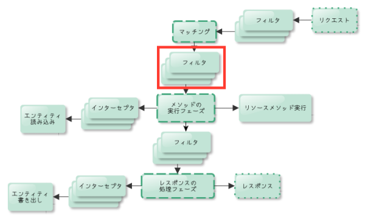
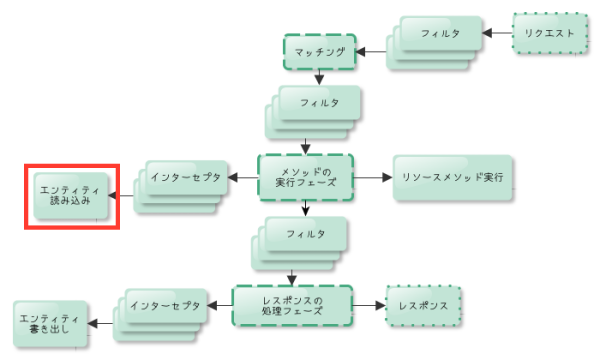
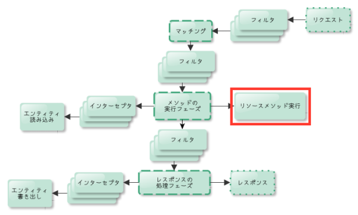
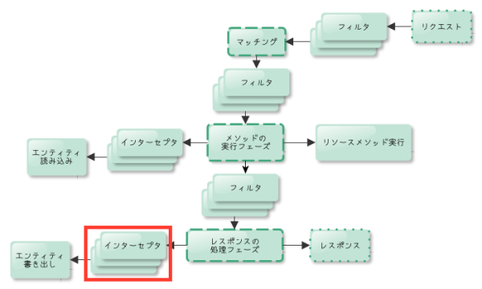
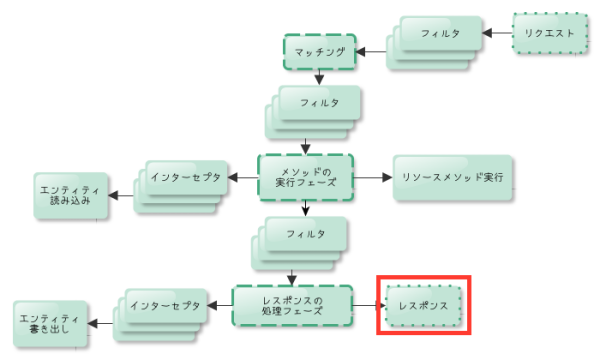

# JAX-RS入門<br/>および実践

[@backpaper0](https://twitter.com/backpaper0)

2015-11-28 [JJUG CCC 2015 Fall](http://www.java-users.jp/?page_id=2056)

---

## 自己紹介

* うらがみ
* 大阪でSIerやっています
* プログラマ歴8年半ぐらい(ほとんどJava)
* JAX-RSでのお仕事歴は4年ぐらい

---

## 本日の発表内容

* JAX-RSの概要
* JAX-RSの入門的な解説
* 実践の話をいくつか

---

## JAX-RSとは


## JAX-RSの概要

* Java EE 6から登場したWebフレームワーク
* [JSR 339](https://jcp.org/en/jsr/detail?id=339)、参照実装は[Jersey](https://jersey.java.net/)
* アノテーションを使用して宣言的にHTTPリクエスト・レスポンスをJavaコードにマッピングする
* RESTful APIを作るのに特化している


### Java EEにはServletやJSFといった<br/>Webフレームワークがあるのでは？


### ServletとJAX-RS

* Servletは数多のWebフレームワークのベースとなっている
  * JAX-RSはそれ単体で使用できるWebフレームワーク

* ServletはAPIが手続き的
  * JAX-RSの方が宣言的に書く事ができる


### JSFとJAX-RS

* JSFはServlet上に構築されている
  * JAX-RSはServlet APIに依存しない

* JSFはHTTPをなるべく意識せずデスクトップGUIに近い感覚で画面が作れる
  * JAX-RSはHTTPを宣言的にJavaコードにマッピングする

* JSFはXHTMLのテンプレートエンジンがあり、画面がある事が前提
  * JAX-RSはRESTful APIが主戦場


### JAX-RS/Servlet/JSF比較

<table>
<tr>
<th></th>
<th>JAX-RS</th>
<th>Servlet</th>
<th>JSF</th>
</tr>
<tr>
<th>APIのレベル感</th>
<td>高レベル</td>
<td>低レベル</td>
<td>高レベル</td>
</tr>
<tr>
<th>特徴</th>
<td>HTTPを宣言的にマッピング</td>
<td>際立った特徴は無い</td>
<td>デスクトップGUIのような感覚</td>
</tr>
<tr>
<th>向いているもの</th>
<td>RESTful API</td>
<td>他のフレームワークのベース</td>
<td>画面有りのWebアプリケーション</td>
</tr>
</table>


### 簡単な例

* ServletとJAX-RSで足し算してみてコードの違いを確認
* `/addition?a=1&b=2` にアクセスすると `3` が返ってくるといった仕様

※JSFは方向性が違いすぎるので割愛します


### Servletで足し算

```java
@WebServlet(urlPatterns = "addition")
public class Addition extends HttpServlet {
    protected void doGet(HttpServletRequest req, HttpServletResponse resp) throws ServletException, IOException {
        int a = Integer.parseInt(req.getParameter("a"));
        int b = Integer.parseInt(req.getParameter("b"));
        resp.setContentType("text/plain");
        try (PrintWriter out = resp.getWriter()) {
            out.print(a + b);
        }
    }
}
```


### JAX-RSで足し算

```java
@Path("addition")
public class Addition {
    @GET
    @Produces("text/plain")
    public int calculate(@QueryParam("a") int a,
                         @QueryParam("b") int b) {
        return a + b;
    }
}
```


### 宣言だけ抜粋

* Servletは `/addition` にGETメソッドでアクセスする、としか読み取れないのに対して……

```java
@WebServlet(urlPatterns = "addition")
public class Addition extends HttpServlet {
    protected void doGet(HttpServletRequest req, HttpServletResponse resp) throws ServletException, IOException { ... }
```

* JAX-RSは `/addition` にクエリパラメータ `a` と `b` を付与してGETメソッドでアクセスすると `text/plain` なエンティティが返ってくる、と読み取れる

```java
@Path("addition")
public class Addition {
    @GET
    @Produces("text/plain")
    public int calculate(@QueryParam("a") int a,
                         @QueryParam("b") int b) { ... }
```


### 宣言から読み取れるということは

* パスやContent-Type、パラメータの名前はコンパイル時に解決できる
* ドキュメントの生成やモックの自動生成が行いやすい


### JAX-RS/Servlet/JSFまとめ

* それぞれ向いている用途が異なる
* JAX-RSはRESTful APIに向いている
* JAX-RSはHTTPをJavaコードに宣言的にマッピングする

---

## JAX-RSの仕様について


### JAX-RSアプリケーションの構成要素

* リソースクラス
* フィルタ・インターセプタ
* エンティティボディの読み込み・書き出し
* 例外ハンドラー
* アプリケーションの定義

* クライアントAPI


### JAX-RSアプリケーションの構成要素

* **リソースクラス**
* フィルタ・インターセプタ
* エンティティボディの読み込み・書き出し
* 例外ハンドラー
* アプリケーションの定義

* クライアントAPI


## リソースクラス

* HTTPリクエストを受け取るエンドポイントとなるクラス
* `@Path` で注釈し、少なくとも1つのリソースメソッドを持つ

* リソースメソッドは `@GET` や `@POST` などHTTPメソッドを表すアノテーションで注釈したメソッド
* 他にもアノテーションを利用して受け取るパラメータやContent-Typeなどを設定できる


### Additionクラス再掲

```java
@Path("addition")
public class Addition {
    @GET
    @Produces("text/plain")
    public int calculate(@QueryParam("a") int a,
                         @QueryParam("b") int b) {
        return a + b;
    }
}
```

* `@Path` でパスを設定する
* `@GET` でGETメソッドを受け付ける事を設定する
* `@Produces` でレスポンスのエンティティのContent-Typeを設定する
* `@QueryParam` でクエリパラメータを受け取る事を設定する


### HTTPリクエストとの対比

```java
@Path("addition")
public class Addition {
    @GET
    @Produces("text/plain")
    public int calculate(@QueryParam("a") int a,
                         @QueryParam("b") int b) {
        return a + b;
    }
}
```

* この `Addition.calculate` は次のようなHTTPリクエストを処理する

```
GET /addition?a=1&b=2 HTTP/1.1
Accept: text/plain

```


### パスのマッピング

`@Path` はメソッドにも付けて階層を表せられる

```java
@Path("hello")
public class Hello {

    @GET
    public String say() { ... }

    @Path("world")
    @GET
    public String world() { ... }
}
```

この場合 `/hello` へのリクエストは `say` メソッドに、

`/hello/world` へのリクエストは `world` メソッドにマッピングされる


### パスのマッピング

また、パスは `{` と `}` で囲む事で変数として使える

```java
@GET
@Path("hello/{name}")
public String sayHello(
        @PathParam("name") String name) {
    ...
```

変数に取れる文字は正規表現で制限できる

次の例だと変数 `userId` は数字のみで構成される

```java
@Path("users/{userId:\\d+}")
```


### パラメータのマッピング

HTTPリクエストに含まれる次の項目をパラメータにできる

* クエリパラメータ
* パスの一部
* Matrix URI
* リクエストヘッダ
* Cookie
* フォームコントロールの値


### クエリパラメータとパスの一部

すでに紹介している機能

```java
@Path("foo/{foo}")
public class Foo {
    @GET
    public String bar(
            @PathParam("foo") String foo,
            @QueryParam("bar") String bar) {
        ...
```

これは次のようなリクエストパスに対応する

```
/foo/xxx?bar=yyy
```


## Matrix URI

```java
@Path("addition")
public class Addition {
    @GET
    public String calculate(
            @MatrixParam("left") int left,
            @MatrixParam("right") int right) {
        ...
```

これは次のようなリクエストパスに対応する

```
/addition;left=2;right=3
```


### リクエストヘッダ、Cookie

```
@GET
public String get(
        @HeaderParam("foo") String foo,
        @CookieParam("bar") String bar) {
    ...
```

これは次のようなHTTPリクエストヘッダに対応する

```
GET /hoge HTTP/1.1
Foo: xxx
Cookie: bar=yyy
```


### フォームコントロールの値

HTMLのform要素から送信される値をマッピングする

```java
@POST
@Produces("application/x-www-form-urlencoded")
public String sayHello(
        @FormParam("yourName") String name) {
    ...
```

これは次のようなフォームコントロールに対応する

```html
<form method="POST" action="hello">
  <input type="text" name="yourName">
  ...
```


### バリューオブジェクトで受け取る

また、これまで紹介したアノテーションを使ったパラメータのマッピングではバリューオブジェクトを利用できる

```java
public class ValueObject {
    private final String value;
    public ValueObject(String value) {
        this.value = value;
    }
    public String getValue() { return value; }
}
```

```java
@GET
public String get(
    //引数にバリューオブジェクトを使用できる
    @QueryParam("value") ValueObject vo) { ... }
```


### 引数に使えるバリューオブジェクト

* Stringの引数をひとつだけ受け取るpublicなコンストラクタを持つクラス
* Stringの引数をひとつだけ受け取る `valueOf` という名前のstaticファクトリメソッドを持つクラス
* Stringの引数をひとつだけ受け取る `fromString` という名前のstaticファクトリメソッドを持つクラス


### 既存のクラスを引数に使いたい場合

* ライブラリに含まれているクラスなど、コンストラクタや `valueOf`・`fromString`の追加ができない場合
* `ParamConverter` インターフェースを実装したクラスを用意すればどんなクラスもパラメータとして使える


### 例：LocalDateのParamConverter

```java
public class LocalDateConverter
        implements ParamConverter<LocalDate> {

    public LocalDate fromString(String value) {
        //※nullが渡される事があるので注意！
        return Optional.ofNullable(value)
                       .map(LocalDate::parse)
                       .orElse(null);
    }

    public String toString(LocalDate value) { ... }
}
```


### エンティティボディを受け取る

引数にアノテーションを付けずエンティティボディをそのまま受け取る事もできる

```java
@Path("echo")
public static class Echo {
    @POST
    @Consumes("text/plain")
    public String echo(String text) {
        return text;
    }
}
```

`@Consumes` ではこのリソースメソッドが受け付けるエンティティのContent-Typeを指定できる


### 対応するHTTPリクエスト

これは次のようなHTTPリクエストに対応する

```
POST /echo HTTP/1.1
Content-Type: text/plain
...(略)...

HelloWorld
```

この場合は引数 `text` には `"HelloWorld"` が渡される


### XMLをPOJOで受け取る

エンティティボディがXMLの場合、JAXBでPOJOに変換して受け取る機能が標準装備されている

```java
@XmlRootElement
public static class Person {
    private String name;
    private int age;
    ...(アクセサ省略)...
}
```

```java
@Path("person")
public class PersonApi {
    @POST
    @Consumes("application/xml")
    public void post(Person person) {
        ...
```


### 対応するHTTPリクエスト

これは次のようなエンティティボディにXMLを含むHTTPリクエストに対応する

```
POST /person HTTP/1.1
Content-Type: application/xml
...(略)...

<person>
  <name>うらがみ</name>
  <age>31</age>
</person>
```


## JSONをPOJOで受け取る

`@Consumes` の中身を `"application/json"` に変えればJSONを受け取る事もできる

```java
@Path("person")
public class PersonApi {
    @POST
    @Consumes("application/json")
    public void post(Person person) {
        ...
```


### 対応するHTTPリクエスト

これは次のようなエンティティボディにJSONを含むHTTPリクエストに対応する

```
POST /person HTTP/1.1
Content-Type: application/json
...(略)...

{"name":"うらがみ","age":31}
```

*※ただしJSONをPOJOで受け取る機能はJAX-RSの仕様ではなくGlassFishが対応してくれているだけ*


### JAX-RSアプリケーションの構成要素

* リソースクラス
* **フィルタ・インターセプタ**
* **エンティティボディの読み込み・書き出し**
* 例外ハンドラー
* アプリケーションの定義

* クライアントAPI


### リクエストを処理する流れ


* 参考：JSR 339 - Appendix C Processing Pipeline


### 1. リクエストを受け付ける


### 2. フィルタリング(マッチング前)


* 実行されるリソースメソッドが決定される前
* `@PreMatching` が付いた `ContainerRequestFilter` の実行
* HTTPメソッドやリクエストURLの上書きが可能


### 例：HTTPメソッドを上書きするContainerRequestFilter

```java
@Provider
@PreMatching
public class PseudoHttpMethodFilter implements ContainerRequestFilter {

    public void filter(ContainerRequestContext rc) throws IOException {
        String method = rc.getHeaderString("X-Http-Method-Override");
        if (method != null) {
            rc.setMethod(method);
        }
    }
}
```


### 3. リソースメソッドの決定


* HTTPメソッドやリクエストパスでリソースメソッドとマッチング


### 4. フィルタリング(マッチング後)



* ( `@PreMatching` が付いていない)残りの `ContainerRequestFilter` でリクエストをフィルタリング


### 5. エンティティボディを加工


* `ReaderInterceptor` でエンティティボディをJavaのオブジェクトに加工する前に加工できる
* 例えば暗号化されたデータの複号化


### 例：複号化するReaderInterceptor

```java
@Provider
public class Decrypter implements ReaderInterceptor {

    public Object aroundReadFrom(ReaderInterceptorContext context)
            throws IOException, WebApplicationException {
        try {
            Cipher c = ...(略)...
            InputStream in = context.getInputStream();
            context.setInputStream(new CipherInputStream(in, c));
            return context.proceed();
        } catch (GeneralSecurityException e) {
            throw new InternalServerErrorException(e);
        }
    }
}
```


### 6. エンティティボディの変換



* `MessageBodyReader` でエンティティボディをJavaのオブジェクトに変換
* 先に説明をしたXMLやJSONをPOJOで受け取る仕組みの正体


### 例：エンティティボディをPropertiesに変換するMessageBodyReader

```java
@Provider
public class PropertiesReader
        implements MessageBodyReader<Properties> {

    public boolean isReadable(Class<?> type, Type genericType, Annotation[] annotations, MediaType mediaType) {
        return true;
    }

    public Properties readFrom(Class<Properties> type, Type genericType, Annotation[] annotations, MediaType mediaType, MultivaluedMap<String, String> httpHeaders,
            InputStream entityStream) throws IOException, WebApplicationException {
        Properties props = new Properties();
        props.load(entityStream);
        return props;
    }
}
```


### 7. リソースメソッドを実行




### 8. レスポンスのフィルタリング


* `ContainerResponseFilter` を実行
* リソースメソッドの戻り値などを見てステータスコードやエンティティボディを変更できる


### 例：空のリストだったら204 No Contentを返すContainerResponseFilter

```
@Provider
public static class EmptyListToNoContentProvider
        implements ContainerResponseFilter {

    @Override
    public void filter(ContainerRequestContext requestContext,
            ContainerResponseContext responseContext) throws IOException {
        Object entity = responseContext.getEntity();
        if (entity instanceof List && ((List<?>) entity).isEmpty()) {
            responseContext.setStatus(204);
        }
    }
}
```


### 9. 戻り値の変換



* `WriterInterceptor` でリソースメソッドの戻り値がエンティティボディに書き出される前にレスポンスを加工できる


### 例：暗号化するWriterInterceptor

```java
@Provider
public class Encripter implements WriterInterceptor {

    @Override
    public void aroundWriteTo(WriterInterceptorContext context)
            throws IOException, WebApplicationException {
        try {
            Cipher c = ...(省略)...
            OutputStream out = context.getOutputStream();
            context.setOutputStream(new CipherOutputStream(out, c));
            context.proceed();
        } catch (GeneralSecurityException e) {
            throw new InternalServerErrorException(e);
        }
    }
}
```


### 10. エンティティボディの書き出し


* `MessageBodyWriter` でリソースメソッドの戻り値をエンティティボディに書き出す


### 例：Propertiesをエンティティボディに書き出すMessageBodyWriter

```java
@Provider
public class PropertiesWriter implements MessageBodyWriter<Properties> {

    public boolean isWriteable(Class<?> type, Type genericType, Annotation[] annotations, MediaType mediaType) {
        return true;
    }

    public long getSize(Properties t, Class<?> type, Type genericType, Annotation[] annotations, MediaType mediaType) {
        return -1;
    }

    public void writeTo(Properties t, Class<?> type, Type genericType, Annotation[] annotations, MediaType mediaType, MultivaluedMap<String, Object> httpHeaders,
            OutputStream entityStream) throws IOException, WebApplicationException {
        t.store(entityStream, "");
    }
}
```


### 11. レスポンスを返す




### JAX-RSアプリケーションの構成要素

* リソースクラス
* フィルタ・インターセプタ
* エンティティボディの読み込み・書き出し
* **例外ハンドラー**
* アプリケーションの定義

* クライアントAPI


### ExceptionMapper

* リソースメソッドで投げられた例外をハンドリングする
* ハンドリング対象の例外クラスは型変数で指定する

```java
@Provider
public class SQLExceptionMapper implements
        ExceptionMapper<SQLException> {

    public Response toResponse(SQLException e) {
        ...(省略)...
        return Response.serverError().build();
    }
}
```


### JAX-RSアプリケーションの構成要素

* リソースクラス
* フィルタ・インターセプタ
* エンティティボディの読み込み・書き出し
* 例外ハンドラー
* **アプリケーションの定義**

* クライアントAPI


### Application

* JAX-RSアプリケーションの構成を表す
* `Application` クラスのサブクラスを作ってリソースクラスや各種プロバイダーを返すメソッドをオーバーライドする
* `@ApplicationPath` で注釈してルートとなるパスを設定する


### 例：Applicationサブクラス

```java
@ApplicationPath("api")
public class MyApplication extends Application {
    private final Set<Class<?>> classes = new HashSet<>();

    public MyApplication() {
        classes.add(Addition.class);
        classes.add(BasicAuthProvider.class);
        classes.add(PropertiesReader.class);
    }

    public Set<Class<?>> getClasses() {
        return classes;
    }
}
```


### Java EE環境でのApplicationサブクラス

* Java EE環境下では `@Path` で注釈されたクラスをリソースクラス、 `@Provider` で注釈されたクラスをプロバイダーと認識して自動で登録してくれる
* メソッドをオーバーライドしてリソースクラス・プロバイダーを登録する必要が無い

```java
@ApplicationPath("api")
public class MyApplication extends Application {
}
```


### JAX-RSアプリケーションの構成要素

* リソースクラス
* フィルタ・インターセプタ
* エンティティボディの読み込み・書き出し
* 例外ハンドラー
* アプリケーションの定義

* **クライアントAPI**


## クライアントAPI

* ビルダーパターンで書けるHTTPクライアント

```
Client client = ClientBuilder.newClient();
String result = client.target("http://localhost:8080/account")
        //クエリパラメータを設定
        .queryParam("id", "backpaper0").request()
        //リクエストヘッダを設定
        .header("X-Client-ID", clientId)
        //リクエストボディをJSONで送って、
        //レスポンスボディをStringで受け取る
        .post(Entity.json(account), String.class);
```

---

## ここから実践の話


## ※おことわり

* 私の経験をお話するので、すべての人にとって良い方法というわけではありません
* Jersey、GlassFishに特化したお話もあります


### 経験したJAX-RS案件たち

* JAX-RS1, GlassFish3, HTML, Knockout
* JAX-RS1, GlassFish3, Android
* JAX-RS2, Tomcat7, Jersey MVC, JSP
* JAX-RS2, Payara, Android

---

## 実践の話

* 認証
* バリデーション
* 宣言的トランザクション
* 大量データのダウンロード
* MVCと状態の持ち方
* テストコード

---

## 実践の話

* **認証**
* バリデーション
* 宣言的トランザクション
* 大量データのダウンロード
* MVCと状態の持ち方
* テストコード


### 認証はどのように行うのが良いか？


### Java EEにはレルム認証がある


### レルム認証の手順

* アプリケーションサーバ側でレルムの設定を行う
* `web.xml` で `security-constraint` 要素を書いてURLで認証対象範囲を指定する
* コードを変更する必要は無い


### レルム認証への期待

* アプリケーションサーバに依存しなくて高ポータビリティ
* デプロイされたすべてのアプリケーションに適用できて高再利用性
* アプリケーションを変更せず認証ロジックを変更できる


### レルム認証の実際……

* アプリケーションサーバを変更する事は無い
* 1つのWARしかデプロイしない
* 認証ロジックを変更したい事は無い


## JAX-RSのフィルタで認証


### JAX-RSのフィルタでの認証方法

* `ContainerRequestFilter` で認証を行う
* 認証対象範囲はアノテーションで指定する


### 例：Basic認証するContainerRequestFilter

```java
@Provider
public class BasicAuthProvider implements ContainerRequestFilter {

    public void filter(ContainerRequestContext rc) throws IOException {
        String header = rc.getHeaderString("Authorization");
        if (header == null || authenticate(header) == false) {
            //認証失敗
            Response response = Response.status(401)
                    .header("WWW-Authenticate", "Basic Realm=secret")
                    .build();
            rc.abortWith(response);
        }
    }
    ...(略)...
}
```


### JAX-RSのフィルタで認証するメリット

* 認証対象範囲をURLではなくアノテーションで指定できる
  (対象範囲がより明確になる)


### フィルタの適用方法

`@NameBinding` で注釈したアノテーションを用意して、

```java
@NameBinding
@Retention(RetentionPolicy.RUNTIME)
public @interface Protected {
}
```


### フィルタの適用方法

フィルタとリソースクラスに付けて両者を結びつける

```java
//フィルタ
@Protected
@Provider
public class BasicAuthProvider
        implements ContainerRequestFilter { ... }
```

```java
//リソースクラス
@Protected
@Path("hoge")
public class HogeResource { ... }
```


### 適用対象をアノテーションで設定することで

* アノテーションに意味のある名前を付ける事でリソースクラスの性質が明確になる


### 認証まとめ

* レルム認証よりもJAX-RS内で認証
* アノテーションで認証される事を明確にできる

---

## 実践の話

* 認証
* **バリデーション**
* 宣言的トランザクション
* 大量データのダウンロード
* MVCと状態の持ち方
* テストコード


### バリデーションはどうすれば良い？


### JAX-RSのバリデーション事情

* JAX-RSにはバリデーションの仕様が無い
* Java EEにはBean Validationというバリデーションの仕様がある
* Java EE環境であればリソースメソッド実行時に引数に対してBean Validationでバリデーション出来る


### 例：引数を直接バリデーションする

```java
@GET
public String sayHello(
        @NotNull @QueryParam("name") String name) {
    return String.format("Hello, %s!", name);
}
```

* `@NotNull` で `name` が `null` でない事をバリデーションする


### 例：引数のフィールドをバリデーションする

```java
@POST
@Produces(MediaType.APPLICATION_XML)
public void create(@Valid Person person) { ... }
```

```java
@XmlRootElement
public static class Person {

    @NotNull
    public String name;

    @Min(0)
    public int age;
}
```


### バリデーションでinvalidだった場合

* `ConstraintViolationException` が投げられる
* そのまま何もしなければ `400 Bad Request` が返される
* エラーメッセージを返したい場合などは `ExceptionMapper` を使う


### 例：エラーメッセージを返すExceptionMapper

```
@Provider
public class InvalidMessagesProvider
        implements ExceptionMapper<ConstraintViolationException> {

    @Override
    public Response toResponse(ConstraintViolationException e) {
        //エラーメッセージを , で区切ったものを返す
        String messages = e.getConstraintViolations().stream()
                .map(ConstraintViolation::getMessage)
                .collect(Collectors.joining(","));
        return Response.status(400).entity(messages).build();
    }
}
```


### バリデーションまとめ

* Java EE環境ならBean Validationでバリデーションできる
* エラーメッセージを返したい場合はカスタマイズが必要

---

## 実践の話

* 認証
* バリデーション
* **宣言的トランザクション**
* 大量データのダウンロード
* MVCと状態の持ち方
* テストコード


### 宣言的トランザクションとは

* あるメソッドを呼び出したときにトランザクションを開始
* メソッドを終了するときにトランザクションをコミット
* メソッドから例外が投げられたときはロールバック


### リソースメソッドで宣言的トランザクションをする方法

1. リソースクラスをCDI管理ビーンにして
2. `@Transactional` を付けるのが簡単(※JTAとCDIの機能)

なお、リソースクラスをCDI管理ビーンにするには `@RequestScoped` で注釈する。


### 例：宣言的トランザクション

```java
@RequestScoped
@Transactional
@Path("sample")
public class SampleResource {
    ...(略)...
```

このクラスに定義されるリソースメソッドはすべて宣言的トランザクションを行う


### 例：宣言的トランザクション

```
@RequestScoped
@Path("sample")
public class SampleResource {

    @Transactional
    @POST
    public void create(@FormParam("name") String name) {
        ...(略)...
```

`@Transactional` はメソッドに付けても良い

宣言的トランザクションを行うメソッド・行わないメソッドを分ける事ができる


### リソースメソッドで宣言的トランザクションをした場合……

* 1リクエスト内で複数のトランザクションを扱いたい場合やそもそもトランザクションを開始したくない場合に面倒
* 宣言的トランザクションを行うリソースクラスと行わないリソースクラスの混在


### 改善案

1. リソースクラスをCDI管理ビーンにして
2. 宣言的トランザクションを行うCDI管理ビーンを作成し
3. リソースクラスにインジェクションする
4. リソースメソッドからはそのクラスのメソッドを呼ぶ


### 例：ビジネスロジック

```java
@ApplicationScoped
@Transactional
public class SampleService {
    ...
```

ビジネスロジックを切り出したCDI管理ビーンに `@Transactional` を付けてトランザクション境界にする


### 例：

```java
@RequestScoped
@Path("sample")
public class SampleResource {
    @Inject
    private SampleService service;

    @POST
    @Consumes("application/xml")
    public void create(Sample sample) {
        service.create(sample);
    }
}
```

リソースクラスでは宣言的トランザクションせず、そのCDI管理ビーンをインジェクションして使う


### 宣言的トランザクションまとめ

* リソースクラスはトランザクション境界にしない方が良い
* あくまでもHTTPとJavaコードを繋ぐものと捉える
* ビジネスロジックはリソースクラス以降のレイヤーにする

---

## 実践の話

* 認証
* バリデーション
* 宣言的トランザクション
* **大量データのダウンロード**
* MVCと状態の持ち方
* テストコード


### 大量データのダウンロード

* CSVダウンロードなど
* 素直に書くと、リソースメソッド内で時間をかけて取得した大量データを戻り値にする、という実装になる


### コード例

```java
@GET @Produces("text/csv")
public Response downloadCsv() {

    // 長い時間がかかり、大量データを扱う処理
    String csv = createCsv();

    String filename = "sample.csv";
    return Response.ok(csv).header(
            HttpHeaders.CONTENT_DISPOSITION,
            "attachment; filename=" + filename).build();
}
```


## 問題点

* 長い時間がかかるのでリクエストを捌くスレッドを占有してしまう
* 大量データを扱うのでヒープを圧迫してしまう


### 解決策その1：非同期処理

* まずはスレッドを占有する問題を解決する
* リソースメソッドは別スレッドで処理を行ってレスポンスを構築する事ができる(`@Suspended`、`AsyncResponse`)

```java
@GET @Produces("text/csv")
public void downloadCsv(@Suspended AsyncResponse ar) {
    // 別スレッドで処理を実行する
    runOtherThread(() -> {
        String csv = createCsv();

        Response response = ...(省略)...
        // 戻り値にしていたオブジェクトを
        // AsyncResponse.resumeに渡す
        ar.resume(response);
    });
}
```


### でもJava EEでは……

* データソースやトランザクションをスレッドに関連付けて管理しているのでカジュアルにスレッドを生成してはいけない

```java
private void runOtherThread(Runnable r) {
    // ×new Threadしてはいけません！
    new Thread(r).start();
}
```


### そこで

* Concurrency Utilities for Java EEとCDIを使う
* Java EE環境で `ExecutorService` を使えるようにする仕様
* リソースクラスをCDI管理ビーンにして `@Resource` で `ManagedExecutorService` をインジェクションする


### 例：ManagedExecutorService

```java
@RequestScoped @Path("csv")
public class CsvApi {

    @Resource
    private ManagedExecutorService executor;
    
    private void runOtherThread(Runnable r) {
        executor.submit(r);
    }

    ...(略)...
```

これで長い時間がかかる処理を別スレッドで実行できる


## ※注意点

* `ManagedExecutorService` が管理するスレッドはリクエストを捌くスレッドではないので `@RequestScoped` の範囲外
* `@RequestScoped` な情報は非同期タスクをインスタンス化するときに渡す必要がある


### 解決策その2：StreamingOutput

* 次に大量データでヒープを圧迫する問題を解決する
* 少しずつデータをフェッチする事が出来るなら `StreamingOutput` を利用すればヒープを節約できる


### 例：StreamingOutput

```java
//void write(OutputStream output)
StreamingOutput so = out -> {
    while(csv.fetch()) { //フェッチして
        out.write(csv.nextLine()); //書き出す
    }
};

//StreamingOutputをエンティティにしてResponseを構築する
Response response = Response.ok(so).build();
```


### StreamingOutputのデメリット

* `OutputStream` にレスポンスのエンティティボディを直接書き出すので `MessageBodyWriter` の恩恵を受けられない


### 最終的なコード例

```java
@Resource private ManagedExecutorService executor;

@GET @Produces("text/csv")
public void downloadCsv(@Suspended AsyncResponse ar) {
    executor.submit(() -> {
        StreamingOutput so = out -> {
            Csv csv = createCsv(); // 長い時間がかかる処理
            while (csv.fetch()) { // 少しずつフェッチして書き出す
                out.write(csv.nextLine());
            }
        };
        String filename = "sample.csv";
        Response response = Response.ok(so).header(HttpHeaders.CONTENT_DISPOSITION, "attachment; filename=" + filename).build();
        ar.resume(response);
    });
}
```


### 大量データまとめ

* `@Suspended` と `AsyncResponse` で非同期処理
* Java EE環境だと `ManagedExecutorService` を使う
* `StreamingOutput` で少しずつ書き出す

---

## 実践の話

* 認証
* バリデーション
* 宣言的トランザクション
* 大量データのダウンロード
* **MVCと状態の持ち方**
* テストコード


### MVCと状態の持ち方

* 冒頭で述べたようにJAX-RSはRESTful APIを作るのに向いている
* RESTful APIでは状態を持たない
* でもテンプレートエンジンと組み合わせて画面有りのアプリケーションを作れない事はない
* 画面がある業務アプリケーションを作っていると状態を持ちたい事がある


### JAX-RSでもMVCがしたい


### Jersey MVC

* テンプレートエンジンと組み合わせる *Jerseyの独自拡張*
* リソースメソッドの戻り値の型を `Viewable` クラスにしてテンプレートのパスとバインドする値を返す
* テンプレートではバインドされた値を `model` という名前で参照できる


### コード例

```java
//リソースメソッド
@GET
public Viewable index() {
    Parameters params = ...(略)...
    return new Viewable("path/to/template", params);
}
```

```jsp
<%-- JSPテンプレート --%>
<p>Hello, ${model.name}!</p>
```

※JSP以外では[FreeMarker](http://freemarker.incubator.apache.org/)、[mustache](https://mustache.github.io/)にデフォルトで対応している


### 状態の持ち方

* JAX-RSの仕様にはセッションの概念が無い
  * リソースクラスのインスタンスはリクエスト毎
  * フィルタなど各プロバイダはアプリケーション毎

* JAX-RSの仕様外で状態を持つしかない


### HttpSessionを使う？

* サーブレットコンテナ上で動かしているならJAX-RSで `HttpServletRequest` を使える
* `HttpServletRequest` から `HttpSession` を取得して状態を管理できなくはない


### コード例

```java
@Context
private HttpServletRequest request;

@GET
public Viewable get() {
    HttpSession session = request.getSession();
    String userId = session.getAttribute("userId");
    return new Viewable("path/to/template", userId);
}
```

* `@Context` で `HttpServletRequest` をインジェクションできる
* 他に `ServletConfig`、`ServletContext`、`HttpServletResponse` もインジェクションできる


## ※これはおすすめしません

* ServletはJAX-RSよりも低レイヤーなAPI
* `HttpSession` への値の登録・取得は型安全ではない
* 個人的にはJAX-RSでServlet APIを使ったら負け、ぐらいに考えている


## おすすめの方法

1. リソースクラスをCDI管理ビーンにして
2. 状態を保持する `@SessionScoped` なCDI管理ビーンをインジェクションする


### 例：リソースクラス

```java
@RequestScoped
@Path("sample")
public class Sample {

    @Inject
    private UserInfo user;

    @GET
    public Viewable get() {
        return new Viewable("path/to/template", user.getId());
    }
}
```


### 例：状態を持つクラス

```java
@SessionScoped
public class UserInfo implements Serializable {

    private String userId;

    public String getUserId() {
        return userId;
    }

    public void setUserId(String userId) {
        this.userId = userId;
    }
}
```


### メリット

* 管理する状態に仕様変更があった場合、シグネチャの変更になるのでコンパイルで守られる
* モックを作成・インジェクションし易く、テストコードが書き易い


## MVC 1.0

* 今回紹介したMVCは*Jerseyの独自拡張*
* Java EE 8には [JSR 371 MVC 1.0](https://www.jcp.org/en/jsr/detail?id=371)が入る予定


### MVCと状態まとめ

* Jersey MVCでMVCできる
* 将来的にはJSR 371でMVCできる
* 状態はCDIでインジェクションすると良い

---

## 実践の話

* 認証
* バリデーション
* 宣言的トランザクション
* 大量データのダウンロード
* MVCと状態の持ち方
* **テストコード**


### テストしたい対象

* ルーティング
* クエリパラメータやフォームパラメータの受け取り
* エンティティの変換
* フィルタやインターセプタの適用


### Jersey Test Frameworkを使う


### Jersey Test Frameworkとは

* JUnit、TestNGでJerseyのテストコードを書くためのフレームワーク
* テスト実行前後にJerseyの起動・終了を行ってくれる
* クライアントAPIのショートカットを用意

※JAX-RSの仕様ではなく *Jerseyの機能*


### 例：Jersey Test Framework

```java
public class AdditionTest extends JerseyTest {
    // テスト対象となるアプリケーションの定義
    protected Application configure() {
        return new ResourceConfig(Addition.class);
    }

    @Test
    public void testCalculate() throws Exception {
        // クライアントAPIを使って検証
        int result = target("addition")
                        .queryParam("a", 1).queryParam("b", 2)
                        .request().get(int.class);
        assertThat(result, is(3));
    }
}
```


### テストしやすいコードのポイント

* ビジネスロジックはCDI管理ビーンに切り出しておく<br/>
  (テストではモックをインジェクションする)
* JAX-RSはHTTPとJavaコードのマッピングに徹してビジネスロジックは別のレイヤーで行う事が大切


### テスト時のDIについて

* [HK2](https://hk2.java.net/)を利用すると良い
* HK2とはJerseyが依存しているDIコンテナで[JSR 330](https://jcp.org/en/jsr/detail?id=330)を実装している
* CDIと同じく `@Inject` でインジェクションができる


### 例：リソースクラス

```java
@RequestScoped
@Path("todo/{id}")
public class TodoResource {

    //ここにモックをインジェクションしてテストする
    @Inject
    private TodoService service;

    @GET
    @Produces(MediaType.APPLICATION_JSON)
    public Todo get(@PathParam("id") int id) {
        return service.find(id);
    }
}
```


### コード例

```java
public class TodoResourceTest extends JerseyTest {
    @Test
    public void testGet() { ...(略)... }

    protected Application configure() {
        Binder binder = new AbstractBinder() {
            protected void configure() {
                bind(MockTodoService.class).to(TodoService.class);
            }
        };
        return new ResourceConfig(TodoResource.class)
                        .register(binder);
    }
}
```


### DIを伴うテストのポイント

* テストが終わったらインスタンスは破棄されるのでライフサイクルは気にしない
* 裏を返せばライフサイクルに依存しないコードを書くよう心がける
* HTTPとのマッピング以上のテストはしない


### テストコードまとめ

* Jerseyを使っているならJersey Test Frameworkが便利
* DIでモックに差し替えやすいように意識する
* JAX-RSの仕様の範囲でテストしたい事のみテストする

---

## まとめ

* JAX-RSはRESTful APIを作るのに特化したフレームワーク
* あくまでもHTTPをJavaコードにマッピングするだけ
* 他のレイヤーと統合するにはCDI(DIコンテナ)を利用する
* Jersey Test Frameworkでテストは簡単に書ける


## 思ったこと

* JAX-RSだけではカバーできない領域がたくさんある
* 試行錯誤と工夫でそれらを乗り越えてきた
* 好きになれるフレームワークを使う事が大切
* JAX-RS大好き！！！
