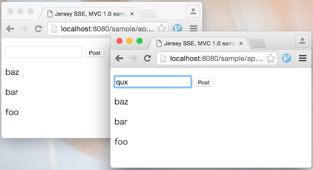

# Java EE 8を先取る

[@backpaper0](https://twitter.com/backpaper0)

2015-12-12 [JavaOne 2015 報告会 @名古屋](http://ngo-java.connpass.com/event/23091/)

---

## Java EE 8新機能

---

## Server-Sent Events (SSE)

* サーバー→クライアントの通知
* HTTPプロトコルで実現

---

## MVC 1.0

* アクションベースのMVC
* JAX-RS拡張として提供

---

## その他

* [JSON Binding](https://www.jcp.org/en/jsr/detail?id=367)
* HTTP/2サポート
* CDIの強化
* [Java EE Management API 2.0](https://www.jcp.org/en/jsr/detail?id=373)
* [Java EE Security API](https://www.jcp.org/en/jsr/detail?id=375)

---

### Java EE 8のリリーススケジュール

[JSR 366](https://www.jcp.org/en/jsr/detail?id=366)より引用

* Q4 2015 Early Draft
* Q1 2016 Public Review
* Q3 2016 Proposed Final Draft
* H1 2017 Final Release

---

## そんなに待てない！！！

---

### そこで……

---

## Jersey SSE Support

JerseyによるServer-Sent Eventsのサポート


---

## Ozark

MVC 1.0の参照実装


---

## ですよ！！！

---

### もうちょい詳しく

---

## Jersey SSE Support

* JerseyはJAX-RSの参照実装
* Jersey SSE SupportはJerseyでSSEするための拡張
* dependenciesに一行足すだけで使える(Gradle)

---

## 例：Jersey SSE

```java
@RequestScoped
@Path("sse")
public class SimpleSSESample {
    @Resource
    private ManagedExecutorService executor;

    @GET
    @Produces(SseFeature.SERVER_SENT_EVENTS)
    public EventOutput sendEvents() {
        EventOutput out = new EventOutput();
        executor.submit(new Task(out));
        return out;
    }
}
```

---

## 例：Jersey SSE

```java
class Task implements Callable<Void> {
    private final EventOutput out;
    public Task(EventOutput out) { this.out = out; }
    public Void call() throws Exception {
        try {
            for (int i = 0; i < 10; i++) {
                TimeUnit.SECONDS.sleep(1);
                OutboundEvent event = new OutboundEvent.Builder()
                        .name("message").data("Hello " + i).build();
                out.write(event);
            }
            return null;
        } finally { out.close(); }
    }
}
```

---

## 例：Jersey SSE

クライアント側のコード(JavaScript)

```javascript
var es = new EventSource('/sample/app/sse');
es.addEventListener('message', function(event) {
    console.log(event.data);
});
```

---

## 例：Jersey SSE

実行結果

```
Hello 0
Hello 1
Hello 2
Hello 3
Hello 4
Hello 5
Hello 6
Hello 7
Hello 8
Hello 9
```

※1秒毎に表示される

---

## 例：Jersey SSE

build.gradleの記述例

```groovy
dependencies {
    compile 'org.glassfish.jersey.media:jersey-media-sse:2.22'
}
```

---

## Ozark

* JSR 371 MVC 1.0の参照実装
* Jerseyをベースに作られている
* JSP、Thymeleaf、mustacheなどのテンプレートに対応
* dependenciesに一行足すだけで使える(Gradle)

---

## 例：Ozark

```java
@RequestScoped
@Path("hello")
public class HelloController {

    @Inject
    private Models models;

    @Controller
    @GET
    public String sayHello(@QueryParam("name") String name) {
        models.put("name", name);
        return "hello.jsp";
    }
}
```

---

## 例：Ozark

```jsp
<%@ page contentType="text/html; charset=UTF-8"%>
<!DOCTYPE html>
<html>
<head>
<title>Hello</title>
</head>
<body>
    <p>Hello, ${name}!</p>
</body>
</html>
```

---

## 例：Ozark

build.gradleの記述例

```groovy
dependencies {
    compile 'org.glassfish.ozark:ozark:1.0.0-m02'
}
```

---

## サンプル作ってみました

https://github.com/backpaper0/jersey-sse-ozark-sample



---

## まとめ

* Java EE 8の新機能の一部は今からでも試せる
* 素振りをしておくとスムーズに導入できる
* もしくは、導入しないという判断もしやすい
