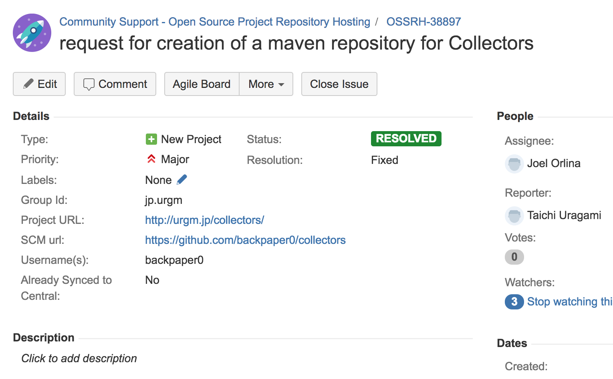
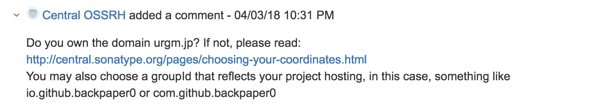
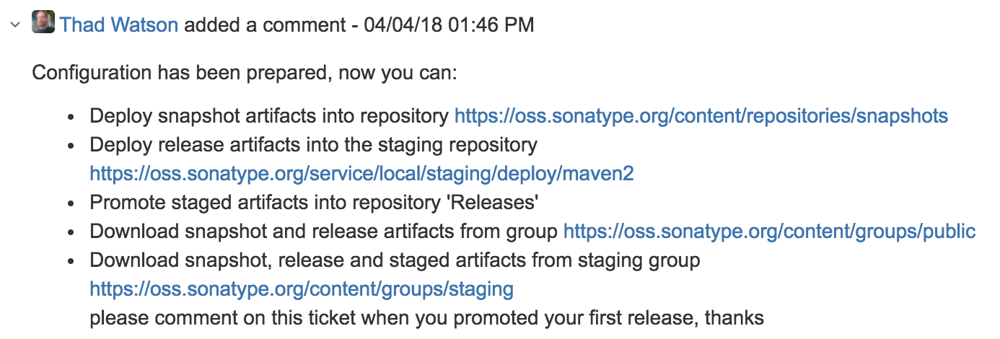
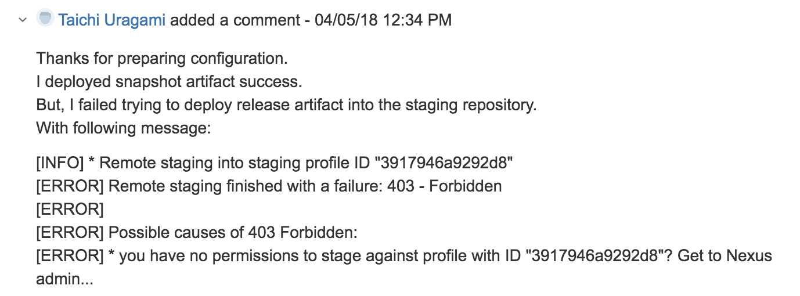
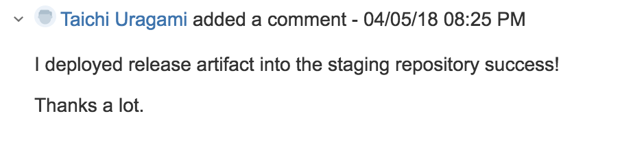
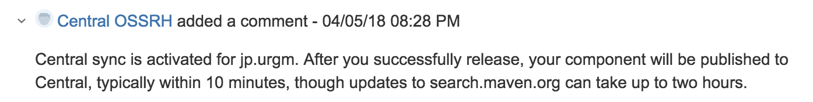
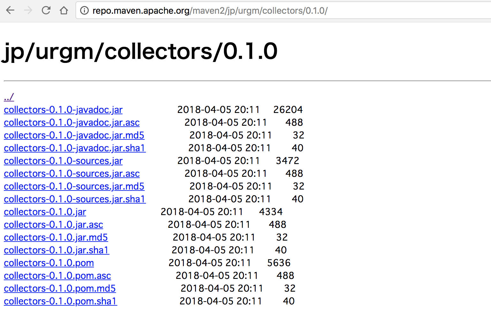

class: center, middle

# 自作ライブラリを<br>Maven Centralで</br>公開してみた

---

## 自己紹介

* うらがみ
* Javaプログラマー
* フレームワーク開発
* 技術支援


---

## 経緯

* なんとなーくドメインを取得した
* urgm.jp
* ついでにMaven Centralに何かアップロードしてみよ

---

## 公開したライブラリ

* https://github.com/backpaper0/collectors
* `java.util.stream.Collector`のユーティリティ

```java
import static jp.urgm.collectors.Collectors0.findFirst;
```

```java
Optional<Hoge> x = stream.collect(findFirst());
```

---

## 手順

* OSSRHのJIRAアカウントを作る
* issueを作る
* GnuPGで鍵を作ってサーバーに登録する
* ビルドしてJARのデジタル署名を生成する
* artifactとデジタル署名をアップロードする
* アップロードしたことをissueにコメントする
* Maven Centralに同期される

---

## OSSRHのJIRAアカウントを作る

* Open Source Software Repository Hosting
* https://issues.sonatype.org/

---

## issueを作る

.image[]

---

## issueを作る

.image[]

---

## issueを作る

.image[]

---

## issueを作る

.image[]

---

## GnuPGで鍵を作ってサーバーに登録する

鍵を作る

```sh
$ gpg --gen-key
```

鍵を一覧する

```sh
$ gpg --list-keys
```

鍵をサーバーに登録する

```sh
$ gpg --keyserver hkp://pool.sks-keyservers.net \
      --send-keys XXXXXXXXXXXXXXXXXXXXXXXXXXXXXXXXXXXXXXXX

```

---

## ビルドしてJARのデジタル署名を生成する

`pom.xml`

```xml
<plugin>
    <groupId>org.apache.maven.plugins</groupId>
    <artifactId>maven-gpg-plugin</artifactId>
    <version>1.6</version>
    <executions>
        <execution>
            <id>sign</id>
            <phase>verify</phase>
            <goals><goal>sign</goal></goals>
        </execution>
    </executions>
</plugin>
```

---

## ビルドしてJARのデジタル署名を生成する

`settings.xml`

```xml
<server>
    <id>gpg.passphrase</id>
    <passphrase>secret</passphrase>
</server>
```

---

## ビルドしてJARのデジタル署名を生成する

```sh
$ mvn --encrypt-master-password xxx
{xxxxxxxxxxxxxxxxxxxxxxxxxxxxxxxxxxxxxxxxxxxx}
```

`~/.m2/settings-security.xml`

```xml
<settingsSecurity>
  <master>{xxxxxxxxxxxxxxxxxxxxxxxxxxxxxxxxxxxxxxxxxxxx}</master>
</settingsSecurity>
```

---

## ビルドしてJARのデジタル署名を生成する

```sh
$ mvn --encrypt-password secret
{xxxxxxxxxxxxxxxxxxxxxxxxxxxxxxxxxxxxxxxxxxxx}
```

`settings.xml`

```xml
<server>
    <id>gpg.passphrase</id>
    <passphrase>{xxxxxxxxxxxxxxxxxxxxxxxxxxxxxxxxxxxxxxxxxxxx}</passphrase>
</server>
```

---

## ビルドしてJARのデジタル署名を生成する

```sh
$ mvnw verify
```

```sh
$ ls target|grep collectors
collectors-0.2.0-SNAPSHOT-javadoc.jar
collectors-0.2.0-SNAPSHOT-javadoc.jar.asc
collectors-0.2.0-SNAPSHOT-sources.jar
collectors-0.2.0-SNAPSHOT-sources.jar.asc
collectors-0.2.0-SNAPSHOT.jar
collectors-0.2.0-SNAPSHOT.jar.asc
collectors-0.2.0-SNAPSHOT.pom
collectors-0.2.0-SNAPSHOT.pom.asc
```

---

## artifactとデジタル署名をアップロードする

`pom.xml`

```xml
<distributionManagement>
    <snapshotRepository>
        <id>ossrh</id>
        <url>https://oss.sonatype.org/content/repositories/snapshots</url>
    </snapshotRepository>
    <repository>
        <id>ossrh</id>
        <url>https://oss.sonatype.org/service/local/staging/deploy/maven2/</url>
    </repository>
</distributionManagement>
```

---

## artifactとデジタル署名をアップロードする

```xml
<plugin>
    <groupId>org.sonatype.plugins</groupId>
    <artifactId>nexus-staging-maven-plugin</artifactId>
    <version>1.6.7</version>
    <extensions>true</extensions>
    <configuration>
        <serverId>ossrh</serverId>
        <nexusUrl>https://oss.sonatype.org/</nexusUrl>
        <autoReleaseAfterClose>true</autoReleaseAfterClose>
    </configuration>
</plugin>
```

---

## artifactとデジタル署名をアップロードする

```sh
mvnw deploy
```

---

## artifactとデジタル署名をアップロードする

.image[]

---

## artifactとデジタル署名をアップロードする

.image[]

---

## アップロードしたことをissueにコメントする

.image[]

---

## アップロードしたことをissueにコメントする

.image[]

---

## Maven Centralに同期される

.image[]

---

## 参考

* https://maven.apache.org/guides/mini/guide-central-repository-upload.html
* http://central.sonatype.org/pages/ossrh-guide.html


