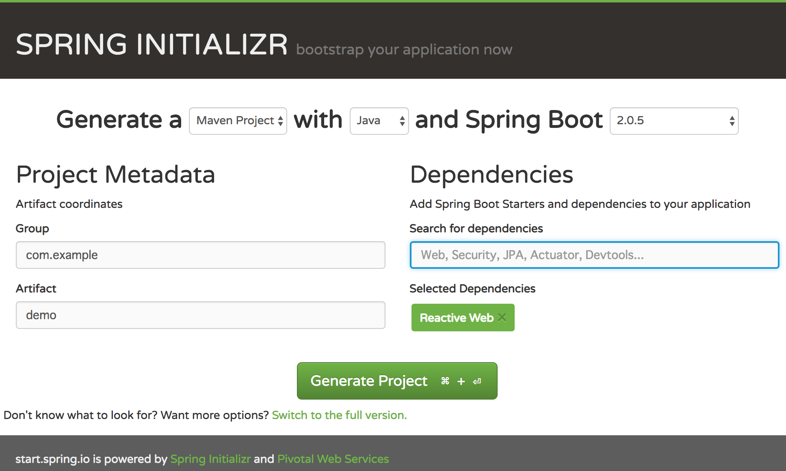

class: center, middle

# Spring WebFluxの話

https://github.com/backpaper0/spring-webflux-example

---

### 自己紹介

* うらがみ⛄️
* Javaプログラマー
* リアクティブシステムまじわからん

---

class: center, middle

# Spring WebFluxとは

---

## Spring WebFluxとは

Spring Web MVC

  - 従来のWebフレームワーク
  - Servlet APIベース

Spring WebFlux

  - Spring 5から追加されたWebフレームワーク
  - ノンブロッキング
  - [Reactive Streams](http://www.reactive-streams.org/)

---

## Reactive Streamsとは

- 非同期ストリーム処理
- ノンブロッキング
- バックプレッシャー

---

## Reactive Streamsとは

仕様

- [java.util.concurrent.Flow](https://docs.oracle.com/javase/jp/10/docs/api/java/util/concurrent/Flow.html)

実装

- [Reactor](https://github.com/reactor/reactor)
  - Reactive Streamsの仕様を満たす実装の1つ
  - Sponsored by Pivotal
  - 他の実装は例えば[RxJava](https://github.com/ReactiveX/RxJava)

---

class: center, middle

# Reactorをざっくり紹介

---

## Reactorをざっくり紹介

重要な2つのクラス

- `Mono`
  - `java.util.Optional`みたいなAPI
  - 単一の値を扱う
- `Flux`
  - `java.util.stream.Stream`みたいなAPI
  - 複数の値を扱う

---

## MonoとFluxのインスタンス構築

`just`で明示的に値を渡してインスタンス化

```java
Mono<String> mono = Mono.just("hello");
```

```java
Flux<String> flux = Flux.just("foo", "bar", "baz");
```

---

## MonoとFluxのインスタンス構築

`empty`で空のインスタンスを取得

```java
Mono<?> mono = Mono.empty();
```

```java
Flux<?> flux = Flux.empty();
```

---

## MonoとFluxのインスタンス構築

`fromXxx`で`Supplier`や`Stream`からインスタンスを構築

```java
Supplier<String> supplier = () -> "foobar";
Mono<String> mono = Mono.fromSupplier(supplier);
```

```java
Stream<String> stream = Stream.of("foo", "bar", "baz");
Flux<String> flux = Flux.fromStream(stream);
```

こんな感じで色々な方法でインスタンスを構築できる

---

## MonoとFluxの操作

`Optional`や`Stream`みたいに関数型っぽいメソッドを備えている

- `filter`
- `map`
- `flatMap`
- `reduce`

他にも色々な操作がある

---

## MonoとFluxの操作

`zipWith`で2つの`Mono`をくっつける

```java
Mono<String> m1 = Mono.just("foo");
Mono<String> m2 = Mono.just("bar");
Mono<String> m3 = m1.zipWith(m2, (a, b) -> a + b);
//foobar
```

---

## MonoとFluxの操作

`zipWith`で2つの`Flux`をくっつける

```java
Flux<String> f1 = Flux.just("foo", "bar", "baz");
Flux<String> f2 = Flux.just("1", "2", "3");
Flux<String> f3 = f1.zipWith(f2, String::concat);
//foo1, bar2, baz3
```

---

## MonoとFluxのテスト

`Mono`のテストのやり方

値を取り出して`assertEquals`する……？🤔

```java
Mono<String> mono = Mono.just("foobar");

String t = mono.block();
assertEquals("foobar", t);
```

---

## MonoとFluxのテスト

`Flux`のテストのやり方

`Iterable`に変換して`assertIterableEquals`する……？🤔

```java
Flux<String> flux = Flux.just("foo", "bar", "baz");

Iterable<String> i = flux.toIterable();
assertIterableEquals(List.of("foo", "bar", "baz"), i);
```

---

## MonoとFluxのテスト

もっとスマートにテストできるテスティングライブラリが用意されている

```java
Mono<String> mono = Mono.just("foobar");

StepVerifier.create(mono)
        .expectNext("foobar")
        .verifyComplete();
```

---

## MonoとFluxのテスト

`Flux`のテストもこの通り

```java
Flux<String> flux = Flux.just("foo", "bar", "baz");

StepVerifier.create(flux)
        .expectNext("foo", "bar", "baz")
        .verifyComplete();
```

---

class: center, middle

# Spring WebFlux<br>で<br>Hello World

---

## Spring WebFluxでHello World

- プロジェクトを準備する
- コントローラーを作る
- テストを書く

---

## プロジェクトを準備する

[Spring Initializr](https://start.spring.io/)で`Reactive Web`を追加してダウンロード



---

## コントローラーを作る

`@RestController`と`@GetMapping`はSpring Web MVCと同じアノテーション

```java
@RestController
public class HelloController {

    @GetMapping("/hello")
    public Mono<String> getHello() {
        return Mono.just("Hello World");
    }
}
```

---

## コントローラーを作る

```console
$ curl localhost:8080/hello
Hello World
```

---

## コントローラーを作る

複数件の値を返す場合は`Flux`を使う

```java
@GetMapping("/hello-stream")
public Flux<Hello> getHelloStream() {
    return Flux.range(1, 5)
            .map(i -> new Hello("Hello World " + i));
}
```

---

## コントローラーを作る

```java
public final class Hello {

    private final String message;

    public Hello(
            @JsonProperty("message") String message) {
        this.message = Objects.requireNonNull(message);
    }

    //getter省略
}
```

---

## コントローラーを作る

```console
$ curl localhost:8080/hello-stream
[{"message":"Hello World 1"},{"message":"Hello World 2"},{"message":"Hello World 3"},{"message":"Hello World 4"},{"message":"Hello World 5"}]
```

---

## コントローラーを作る

1秒毎に1件を返すようにしてみる

```java
@GetMapping("/hello-stream")
public Flux<Hello> getHelloStream() {
    return Flux.range(1, 5)
            .map(i -> new Hello("Hello World " + i))
            .delayElements(Duration.ofSeconds(1));
}
```

---

## コントローラーを作る

```console
$ # 5秒経ってからドバッと出力される
$ curl localhost:8080/hello-stream
[{"message":"Hello World 1"},{"message":"Hello World 2"},{"message":"Hello World 3"},{"message":"Hello World 4"},{"message":"Hello World 5"}]
```

---

## コントローラーを作る

JSON Streaming

```console
$ # 1秒毎に1要素出力される
$ curl localhost:8080/hello-stream \
>   -H "Accept: application/stream+json"
{"message":"Hello World 1"}
{"message":"Hello World 2"}
{"message":"Hello World 3"}
{"message":"Hello World 4"}
{"message":"Hello World 5"}
```

---

## コントローラーを作る

SSE(Server-Sent Events)

```console
$ # 1秒毎に1要素出力される
$ curl localhost:8080/hello-stream \
>   -H "Accept: text/event-stream"
data:{"message":"Hello World 1"}

data:{"message":"Hello World 2"}

data:{"message":"Hello World 3"}

data:{"message":"Hello World 4"}

data:{"message":"Hello World 5"}
```

---

## コントローラーを作る

JSONをPOJOで受け取る（Jackson）

```java
@PostMapping("/hello")
public Mono<Hello> postHello(
        @RequestBody YourName yourName) {
    return Mono.just(yourName.getName())
            .map(name -> "Hello " + name)
            .map(Hello::new);
}
```

---

## コントローラーを作る

```java
public final class YourName {

    private final String name;

    public YourName(
            @JsonProperty("name") String name) {
        this.name = Objects.requireNonNull(name);
    }

    //getter省略
}
```

---

## コントローラーを作る

```console
$ # JSONを送信する
$ curl localhost:8080/hello \
>   -H "Content-Type: application/json" \
>   -d '{"name":"World"}'
{"message":"Hello World"}
```

---

## テストを書く

テストのために`WebTestClient`というクラスが用意されている

```java
class HelloControllerTest {

    private WebTestClient client = WebTestClient
            .bindToController(new HelloController())
            .build();
}
```

---

## テストを書く

```java
@SpringBootTest
@ExtendWith(SpringExtension.class)
class HelloControllerSpringBootTest {

    @Autowired
    private ApplicationContext applicationContext;
    private WebTestClient client;

    @BeforeEach
    void setUp() {
        client = WebTestClient
                .bindToApplicationContext(applicationContext)
                .build();
    }
```

---

## テストを書く

```java
@Test
void hello() {
    client.get().uri("/hello").exchange()
            .expectBody(String.class)
            .isEqualTo("Hello World");
}
```

---

## テストを書く

```java
@Test
void helloAndStepVerifier() {
    Flux<String> body =
            client.get().uri("/hello").exchange()
            .returnResult(String.class)
            .getResponseBody();

    StepVerifier.create(body)
            .expectNext("Hello World")
            .verifyComplete();
}
```

---

class: center, middle

# Functional Endpoints

---

## Functional Endpoints

Spring WebFluxには2つのプログラミングモデルがある

- Annotated Controllers 
- Functional Endpoints

これまで出て来ていたのはAnnotated Controllers

ここからはFunctional Endpointsを紹介

---

## Functional Endpoints

`ServerRequest`を受け取って`Mono<ServerResponse>`を返す関数を用意する

```java
Mono<ServerResponse> getHello(ServerRequest request) {
    return ServerResponse.ok().contentType(TEXT_PLAIN)
            .syncBody("Hello World");
}
```

---

## Functional Endpoints

`POST`の例もどうぞ

```java
Mono<ServerResponse> postHello(ServerRequest request) {
    var yourName = request.bodyToMono(YourName.class);
    var hello = yourName
            .map(YourName::getName)
            .map(name -> "Hello " + name)
            .map(Hello::new);
    return ServerResponse.ok()
            .contentType(APPLICATION_JSON)
            .body(hello, Hello.class);
}
```

---

## Functional Endpoints

`RouterFunction<ServerResponse>`を構築する

```java
import static org.springframework.web.reactive.function.server.RequestPredicates.*;
import static org.springframework.web.reactive.function.server.RouterFunctions.*;
```

```java
@Bean
RouterFunction<ServerResponse> routerFunction() {
    return route(GET("/hello"), this::getHello)
            .andRoute(POST("/hello"), this::postHello);
}
```

---

## Functional Endpoints

`ApplicationContext`を介さずに動かすこともできる

これはNettyで動かしている例

```java
var router = routerFunction();
var handler = RouterFunctions.toHttpHandler(router);
var adapter = new ReactorHttpHandlerAdapter(handler);
HttpServer.create("localhost", 8080)
          .newHandler(adapter).block();
Thread.sleep(Long.MAX_VALUE);
```

UndertowやTomcat、Jettyでも動かせる

---

## テストを書く

Functional Endpointsのテストにも`WebTestClient`が使える

```java
@SpringJUnitConfig(HelloRouter.class)
public class HelloTest {

    @Autowired
    private HelloRouter router;
    private WebTestClient client;

    //ここにclientのセットアップとテストを書く
}
```

---

## テストを書く

```java
@BeforeEach
void setUp() {
    var routerFunction = router.routerFunction();
    client = WebTestClient
            .bindToRouterFunction(routerFunction)
            .build();
}
```

---

## テストを書く

```java
@Test
void getHello() {
    client.get().uri("/fn/hello").exchange()
            .expectBody(String.class)
            .isEqualTo("Hello World");
}
```

---

class: center, middle

# WebClient

---

## WebClient

ReactorのAPIをベースにしたクライアントも用意されている

`RestTemplate`のリアクティブ版とでも思うといいかも(APIは全然違うけど)

---

## WebClient


```java
WebClient client = WebClient.create(baseUrl);
```

```java
Mono<String> body = client.get().uri("/fn/hello")
        .retrieve().bodyToMono(String.class);
```

```java
Mono<Hello> body = client.post().uri("/fn/hello")
        .contentType(MediaType.APPLICATION_JSON)
        .syncBody(new YourName("WorldXXX"))
        .retrieve().bodyToMono(Hello.class);
```

---

## 注意点

`WebClient`を使う上で注意することを1つ紹介

(`WebClient`に限った話ではないけれど、`WebClient`を扱う場合によくありそう)

例として`/pen`と`/apple`という2つのエンドポイントがあり、それらのレスポンスを足し合わせるとする

それぞれ処理に3秒かかるとして……

---

## 注意点

```java
var pen = client.get().uri("/pen")
        .retrieve().bodyToMono(String.class);

var apple = client.get().uri("/apple")
        .retrieve().bodyToMono(String.class);

var applePen = apple.flatMap(a -> pen.map(p -> a + p));

var s = applePen.block(); //説明のために敢えてblock
```

一連の処理を終えるまで6秒かかる

つまり`/pen`と`/apple`がシリアルに処理されちゃう

---

## 注意点

```java
var pen = client.get().uri("/pen")
        .retrieve().bodyToMono(String.class);

var apple = client.get().uri("/apple")
        .retrieve().bodyToMono(String.class);

var applePen = apple.zipWith(pen, (a, p) -> a + p);

var s = applePen.block(); //説明のために敢えてblock
```

一連の処理は3秒で終えられる

`zipWith`を使うと`/pen`と`/apple`がコンカレントに処理される

---

## 注意点

- `Mono`(や`Flux`)は実際に値が必要になる時に処理される
- `first.flatMap(f -> second.map(s -> apply(f, s)))`のような処理は`flatMap`を待ってから`map`が実行されるので、やめておきましょう
- `zipWith`のような複数の値を合成するメソッドを使用するのがリアクティブっぽい

---

class: center, middle

# その他の話題

---

## 困りそうなこと

コールスタックがReactorだらけで、わけがわからない

[HelloControllerのコールスタック](https://gist.githubusercontent.com/backpaper0/34e0c169799f381340c41bc6607ccb90/raw/1279380ef0c5fa75a56ea8ad082f50b78015bfd4/gistfile1.txt)

本格的に使うなら素振りが必要そう(WebFluxに限った話ではないけれど……)

---

## JDBC……

現状、JDBCがノンブロッキングに対応していない

RDBMSを使う場合は工夫が必要

具体的にはelasticスレッドプールを使用する

ワーカースレッドのプールで、アイドルタイムアウトすると破棄される

ブロッキングIOがある場合に使う

---

## JDBC……

```java
var m = Mono.fromSupplier(() -> {
            SomeEntity entity = ... //ここでDBアクセス
            return entity;
        })
        //elasticスレッドプールを使用する
        .subscribeOn(Schedulers.elastic());
```

---

## リアクティブシステムを構築するには

Spring WebFluxだけではリアクティブシステムの構築はできない

- Spring Cloud Stream
- Cloud Foundry/Kubernetes

逆に言うとリアクティブシステムが求められるような状況でない限りSpring WebFluxを使う理由はないのかもしれない

---

## リアクティブ難しい

スレッドに強く関連付けたスタイルから、スレッドに依存しないスタイルへの転換

手続き型プログラミングから、関数型プログラミングへの転換

---

## おわり

コード例

- https://github.com/backpaper0/spring-webflux-example

参考情報

- https://docs.spring.io/spring/docs/current/spring-framework-reference/web-reactive.html
- https://docs.spring.io/spring/docs/current/spring-framework-reference/testing.html#webtestclient
- http://projectreactor.io/docs/core/release/reference/
