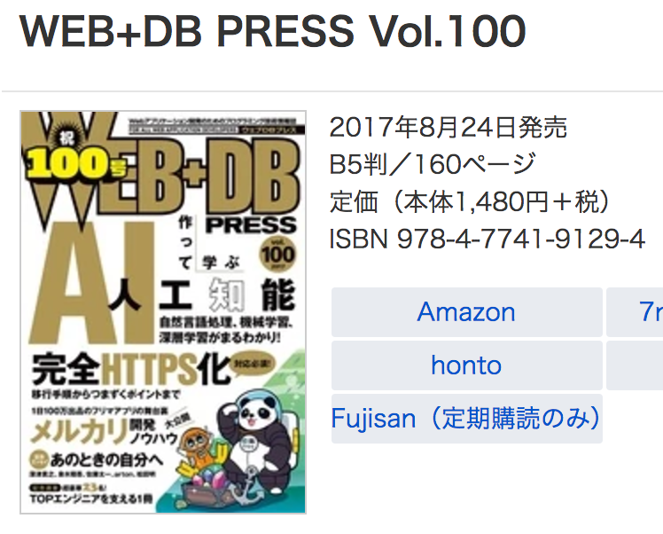
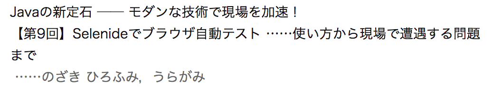

class: center, middle

# Selenideを使ったテストで<br>工夫していることと<br>これからやりたいこと

---

### 自己紹介

* うらがみ⛄️
* 大阪でSIerをしているJavaプログラマ

---

class: center, middle

## Selenideってどんなの？

---

### Selenideとは

* Selenium WebDriver（ブラウザのAPIを叩いて操作するやつ）を使いやすくラップしたフレームワーク
* E2E（End to End）のテスト向き……ブラウザからHTTPを通じてWebアプリケーションを動かしてテストする


---

### Selenideとは

* 開発元：Codeborne社 (http://codeborne.com)
* 所在地：エストニア共和国 首都タリン
* https://github.com/codeborne
* selenide-appiumなんていうリポジトリも出来てた
* Selenideの他にPlay Framework関連のコードもある

???

appiumはAndroidやiOSのアプリケーションに対するテストをWebDriverで書ける仕組み。

---

class: center, middle, eesti-vabariik-tallinn


---

class: center, middle

## Selenideの使い方

---

class: center, middle

## 割愛

---

class: center, middle, wdp100-1



---

class: center, middle, wdp100-2



---

### 何もなさすぎるのもアレなので

少しだけSelenideの利点を紹介

* jQueryっぽい書き方ができる
* Ajaxのテストが簡単
* ベースURLとかウェブドライバーの設定をシステムプロパティで出来て簡単

???

Ajaxを使っているとHTTPリクストを画面から見て非同期で処理して、
レスポンスを受け取ってから画面描画を行うので、
WebDriverは画面描画を待たずにアサーションをしてしまいエラーになったりする。

そういう場合にリトライするコードを書く必要があるけれど、
Selenideは勝手にリトライしてくれるので楽。

ベースURLの設定や使用するウェブドライバーの指定をシステムプロパティで行えるので、
ローカルとCI環境でベースURLが違ったり、
ChromeやFirefoxなど複数の異なるブラウザでテストを行いたい場合に`-D`オプションで切り替えられる。

---

### jQueryっぽい書き方の例

```java
//操作の起点はSelenide#$

//input[type=text]に値を設定
$("#foo").val("ふー");

//要素の内容を取得
String text = $("#bar").text();
```

---

### アサーションの例

```java
//SelenideElement#shouldBeに
//Conditionを渡す

//これはCondition#exactTextの使用例
$("#foo").shouldBe(exactText("ふー"));
```

---

class: center, middle

## 現在の取り組み

???

Selenideの話をする前に仕事で取り組んでいることを軽く紹介

---

### これまで〜今後

* これまで：手動で操作してスクショをExcelへ
* うらがみソロ案件：Selenideでテスト自動化
* うらがみ「もうスクショをExcelへ貼り付けるお仕事は嫌だ！！！」
* 上のえらいひとたちにプッシュ
* 好感触（えらいひとほど理解を示してくれる）
* 今の案件：Selenideで多くのテストを自動化しつつ、その中でスクショ撮る（Excelへは貼り付けない）
* スクショは過渡期の産物
* 今後もテスト自動化を推進していく予定

---

### 今やってるやつの技術スタック

Vue,
axios,
Handsontable,
bulma,
Spring Boot,
Doma,
PostgreSQL,
JUnit,
ava,
Selenide,
DBUnit,
Gradle,
npm,
webpack,
Flyway

???

一気にやりすぎて最初の三週間ぐらいサポートがめっちゃ大変だった。

でも自分がコード書くときにめっちゃ快適。

弊社、Javaスクラッチ案件は小規模ばかりで他にJava詳しい人居ないのでやりたい放題出来て楽しい。

私が行っている工夫をお話します。

---

### 🤔想定通りのページが表示されているか検証したい

ボタン押したら次のページに行く、などページの内容はともかく取り敢えず想定通りのページが表示されていることを検証したい

---

### 😃想定通りのページが表示されているか検証したい

meta要素にページ名を入れてそれを検証

```html
<meta name="page-name" content="hoge-page">
```

```java
$("meta[name=page-name]")
    .should(hasAttribute("content", "hoge-page"));
```

???

Selenideならではの話ではない。

---

### 🤔初期処理の完了を待ちたい

サーバー側テンプレートエンジンは使っていないので、
初期表示したいデータもAjaxで取得している

初期処理の完了を待たずにセレクトボックスを選ぼうとしたりボタンを押したりするのを避けたい

---

### 😃初期処理の完了を待ちたい

状態を表す要素を仕込んで、その要素を確認してから後続処理へ進むのが良さそう

```java
//画面を開く処理
...
//状態を確認
$("#state").shouldBe(exactText("initialized"))
//後続処理
...
```

???

これもSelenideならではの話ではない。

---

### 🤔IEが期待通りの動作をしない

Chromeならストレスなくテスト実行できるけど、
お客様の標準ブラウザはIEなのでIEでテストする

でもIEだと期待通りに動作しなかったりしてつらい

???

valメソッドで値の設定をするが、うまく設定されず文字が欠落する場合がある、など。

もしかしたらVueの仕組みが影響しているのかな？とほんのり思っているけれど未検証。
誰か知っていたら教えてください。

で、この件は文字列全てを一度にsendKeysするのではなくて、1文字ずつsendKeysすれば大丈夫なのでそのようにしたい。
valメソッドは内部的にWebDriverのsendKeysを使っている。

---

### 😃IEが期待通りの動作をしない

コードを読むと、
操作の起点となる`SelenideElement`はdynamic proxyになっており、
メソッド名を元に取得した`Command`へ処理を移譲している

`Commands#add`で`Command`を上書きできるので、この辺をhackしてIEの動作を調整する

```java
Commands.getInstance()
    .add("val", new MyValCommand());
```

???

こういう問題はWebDriverのバージョンアップなどで将来的に改善される可能性があるので、
テストコード側ではなくて基盤のコードで対処したい。

dynamic proxyの説明はしないので、リフレクション周りのJavadocを読んでください。

---

### 🤔IEが遅い

（`Command`をhackしたせいもあるけれど……）遅い

???

テスト中はノイズを入れないため、他の作業をしたくない。
とはいえ、画面を見つめながら待っているのも勿体ない。

---

### 😃IEが遅い

Selenium Standalone Serverとリモートドライバーで実行する

```
💻　ローカル
↓　リモート実行（HTTP）
💻　別のPC
```

```console
java -Dremote=http://remote-pc:4444/wd/hub \
     -Dselenide.baseUrl=http://own-pc:8080 \
     ...
```

???

あくまでも今回は従来のいわゆる「単体テスト」を自動化するというコンテキストなので、
ローカルでアプリケーションを動かしてテストを実行している。

テストは全部CIサーバーで回すわー、とかなら不要かも。

---

### 😆IEが遅い

あと、実装中に軽く動作確認したい場合、
Chromeで動くようにしている

```java
StackTraceElement[] as = new Throwable().getStackTrace();
String name = "org.eclipse.jdt.";
if (as[as.length - 1].getClassName().startsWith(name)) {
    //ブラウザをChromeに設定
} else {
    //ブラウザをIEに設定            
}
```

???

対象ブラウザはIEだけど、ブラウザ依存のコードは書いていないので動作確認ぐらいならChromeでも十分。
そしてChromeは速い。

こんな感じのコードをTestRuleに入れている。
チームはEclipseユーザーだらけ。
他のIDEを使いたい場合は自分でなんとかしてくれ。

---

### 🤔コードをVCSからチェックアウトしたらなる早でテスト実行したい

アプリケーションを動かす環境に合わせて設定ファイルを書き換えるのが面倒

* JDBC接続情報
* 一時ファイル置き場
* Chromeドライバー、IEドライバーの場所

など

---

### 😃コードをVCSからチェックアウトしたらなる早でテスト実行したい

* Spring Bootの`Condition`や`Profile`を活用
* `TestRule`でベースURLや対象ブラウザなどを設定

```java
if (System.getProperty("selenide.baseUrl") == null) {
    System.setProperty("selenide.baseUrl",
        "http://localhost:8080");
}
```

???

コマンドラインから設定を上書きして実行する場合を考慮して、
システムプロパティが設定されていなかったら設定するようにしている。

こういった工夫をいくつかして、なる早で実行できるようにしている。

まあ、テストに限った話ではない。
何も考えずにとりあえず実行できるようにしておくと、メンバーの参画時や保守の際にも役に立つ。
それに設定をするコードを読めば、どう設定すれば良いのか分かるし。（ドキュメント代わり）

---

### その他

* テストデータの投入、DBの検証はDBUnit
* ページオブジェクトを半自動生成したい

???

今回はExcelでテストデータや期待値を用意している。
表形式のデータを持つならExcelは楽。
コメントも入れられるし。

デメリットはVCSで差分が見られないこと。
ただ、テストデータや期待値の差分を見たいことはあまり無いのではないかなと思ってる。

それからページオブジェクトについて。
ページオブジェクトとは、簡単に述べると、表示するページを表すクラスを定義して、
そのクラスを操作することでページに対する操作を行う。
要素を特定するためのCSSセレクターなどをカプセル化する。

作るのが面倒なので、フィールドを定義しておけば必要なメソッドは自動生成するようなAnnotation Processorを書こうと思っている。

---

### ページオブジェクトを半自動生成したい

こんな元コードから、

```java
@PageObject
public abstract class Hoge {
    @FindBy(css = "#foo")
    TextField foo;
    @FindBy(css = "#bar")
    Button bar;
}
```

---

### ページオブジェクトを半自動生成したい

こんなやつをコンパイル時生成したい

```java
public class HogePage extends Hoge {
    public HogePage setFoo(String value) {
        ...
    }
    public HogePage fooShould(Condition ... condition) {
        ...
    }
    public HogePage clickBar() {
        ...
    }
}
```

???

Pluggable Annotation Processing APIを使うとコンパイル時コード生成できるので、
それを使ってやりたい。
できそうだなー、っていう感触はあるので時間作ってコード書く。
興味ある人は私のGitHubアクティビティを監視しておいてください。

実際にはメソッド名は日本語にするつもり。
メソッド名を日本語にして、さらに`this`を返すようにしてメソッドチェーンすると、テストコードがめっちゃ読みやすい。

---

### 日本語メソッド + メソッドチェーンの簡単な例

```java
HogePage.open()
    .fooに値をセットする("ふー")
    .barをクリックする()
    .bazを検証(exactText("ばず"))
    .DBを検証("期待値.xlsx");
```

---

class: center, middle

## 質問など

---

## この資料について

* Author: [@backpaper0](https://github.com/backpaper0)
* License:  [The MIT License](https://opensource.org/licenses/MIT)

