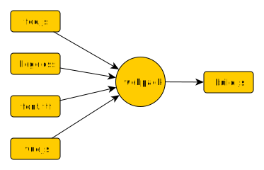
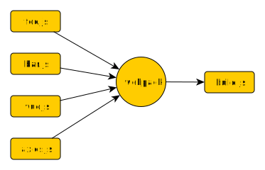
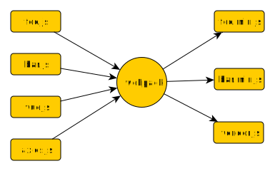
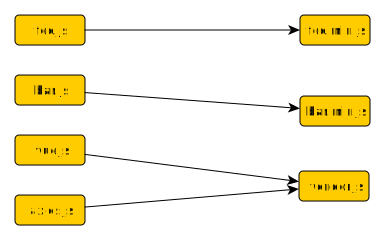

class: center, middle

# Vue + Spring Bootで<br>楽しくフルスタック開発<br>やってみた

---

## 自己紹介

* うらがみ⛄️
* 大阪でSIerをしているJavaプログラマ
* サーバーサイドばっかり
* フロントエンドのスキルは……（お察し）
* 「関西Javaエンジニアの会」（通称「関Java」）

---

## 宣伝：KANJAVA PARTY 2017

大阪で関Java丸一日イベントやります！
<br>初の2トラック！

* 日程：6月24日（土）
* 場所：マイクロソフト関西支店

???
先日のJava Day Tokyoで登壇された技術メモ三銃士の一人、opengl:8080さんや、Open JDKコミッタのきつねさんなど関西を代表する技術者がその実力を見せつけてくれます。

関西の方はもちろん、関西外からのご参加もお待ちしております。

---

class: center, middle

閑話休題

---

## 今日話すこと

* Vueとかwebpackまわり
* Spring Bootと共にビルド
* ぼくのかんがえるさいきょうのすたっく

???
タイトルは釣り。
そもそもフルスタックってなんでしょうね。
StrutsとJSP、生JDBCでもフルスタックでは？

この目次も釣り気味。

実際にはサーバーサイドJavaエンジニアがフロントにも入門したって話。

---

class: center, middle

## Vueとかwebpackまわり

---

### これまで経験したやつ抜粋

* SAStruts + JSP
* JAX-RS + 静的HTML + Knockout
* Spring MVC + Thymeleaf

???
まずはこれまで経験したフロントまわりのフレームワーク、ライブラリを紹介する。

---

### これまで経験したやつ抜粋

* **SAStruts + JSP 👈 まあ時代的にも妥当だった**
* JAX-RS + 静的HTML + Knockout
* Spring MVC + Thymeleaf

???
2010年ぐらいまで。
Seasar2が保守モードに入ると知って次を探した。
Ajaxも今ほど当たり前じゃなくてブラウザ毎の差異が大変っぽかった。
あとIEが本当に低機能だった気がする。

---

### これまで経験したやつ抜粋

* SAStruts + JSP
* **JAX-RS + 静的HTML + Knockout 👈 良かった**
* Spring MVC + Thymeleaf

???
2011年後半ぐらいだったと思う。
サーバーサイドテンプレートに使い勝手の悪さを感じており、デスクトップGUIのイベントベースの作り方に憧れていたとき、Knockoutを知って導入した。

やはりGUIはバインディングが良いなと思った案件。

---

### これまで経験したやつ抜粋

* SAStruts + JSP
* JAX-RS + 静的HTML + Knockout
* **Spring MVC + Thymeleaf 👈 Spring Boot素敵**

???
最近。Thymeleafはサーバーサイドテンプレートエンジンの中では好きな方だけど、やっぱサーバーサイドテンプレートは無くて良いなという思いを強めた。

Spring Bootは最高。
Java EEも公式でmainメソッドから起動できる何かが欲しい。

---

### Knockoutの良さ

双方向データバインディング

* JavaScriptのオブジェクトを変更するとHTMLに反映される
* フォームコントロールで値を入力するとJavaScriptのオブジェクトに反映される

???
jQueryしか知らなかったあの頃。

とてもシンプルで分かりやすい。

---

### データバインディングの良さ

* データの変化を通知してくれる
* ライブラリが変化を監視してくれている
* 我々は通知されたときにすることに集中できる

???
これに対してjQueryはpull型のAPI。
データが変化しているか自分で見に行く必要があり、気にしないといけないことが増える。

これは私がよく言う対比だけど、バインディングとjQueryはDIコンテナのインジェクションとルックアップに似ている。

---

### サーバーサイドテンプレートの<br>好きになれないところ

* HTMLとJavaScriptとテンプレートの式言語が混在
* JavaScriptでDOMいじるならサーバーでレンダリングしなくてもええやん

???
数ページ前でサーバーサイドテンプレートの使い勝手が悪いと言った理由。

画面全体submitするのも好きになれない。

IEもクソでなくなってきたし、そろそろサーバーサイドテンプレートを捨てても良い気がしてきた。

そんな折にとある案件にアサインされました。

---

### 最近やったスマートフォン案件

* Android・iOSの両方に対応
* 機能的にはWebアプリの域を脱しない
* Cordovaを選択

???
Webアプリではないけれど、機能的にはほぼWebアプリ。
カメラとか位置情報を使った何かは要求されなかった。

CordovaはWebViewを利用してHTMLでAndroid・iOSなどのアプリケーションが書けるもの。
開発はChromeのモバイル表示で行い、実機で微調整した。
Cordovaについては今日はこれ以上話しません。

---

### 双方向バインディングしたい

* Cordovaを選択したのは良いけれど、Vanilla JSもjQueryもいやだ
* 双方向バインディングしたい
* Knockoutは古すぎる
* そこでVue

???
Vanilla JSは何かしらのフレームワークではなく、何も使わないすっぴんのjsを指すジョークのようなもの。

KnockoutはIE6をサポート、とかそんな感じの古さ。

---

### Vueのコード例

```vue
<template>
 <span>Hello, {{ yourName }}!</span>
 <input type="text" v-model="yourName">
</template>
<script>
export default {
  data () {
    return { yourName: 'world' }
  }
}
</script>
```

???
要素の内容にバインドする場合はマスタッシュ記法で書く。
input要素などフォームコントロールと双方向バインディングする場合はv-model属性。

templateとscript、この例では書いていないけれどstyleを1つのvueファイルに書ける。
これらはwebpackで処理されJavaScriptにトランスパイルされる。
webpackについては後ほどもう少し詳しく話します。

このファイルをApp.vueという名前で保存して、次のように使います。

---

### Vueのコード例

```js
import Vue from 'vue'
import App from './App.vue'

new Vue({
  el: '#app',
  render: h => h(App)
})
```

???
ブラウザで直接読み込まれるHTMLにappという名前のid属性値を持つdiv要素があり、そこに読み込まれる。

---

### VueでSPA

* Vueで双方向バインディングはOK
* さらにネイティブアプリの雰囲気を出すためにSPAを目指す

???
ネイティブアプリの雰囲気というのは、例えば画面遷移の際にチラつかせないとか、スライドさせるようなアニメーションしたかった。

また、画面をまたいで状態を保持したかった。
パソコンでの利用と異なり、1ページに詰め込まず複数ページに分割して入力・閲覧するため。

---

### VueでSPA

* vue-router 2
* Vuex
* axios

???
VueでSPAを行うために幾つかのプラグインとライブラリを足した。

---

### VueでSPA

* **vue-router 2** 👈 ルーティング
* Vuex
* axios

???
ルーティングを行うためのVueプラグイン。
SPAはjsで画面遷移を擬似的に行うが、表示するページとパスを関連付けて擬似画面遷移をやりやすくするのがルーティング。

vue-router 2はHTML5のHistory APIにも対応。

---

### VueでSPA：vue-router 2

```js
export default new VueRouter({
  routes: [
    { path: '/' ,   component: Home },
    { path: '/foo', component: Foo  },
    { path: '/bar', component: Bar  }
  ]
})
```

???
ルーティングの定義。

pathにアクセスすると指定されたコンポーネントが表示される。

---

### VueでSPA：vue-router 2

```js
//ページ移動
router.push('/foo')

//履歴に残さないなら
router.replace('/foo')

//戻る
router.back()
```

???
ルーティングするコード。

ブラウザがアクセスしているURLも変更されるし、backボタンで戻れる。

replaceメソッドを使うと戻れない。
実案件ではログイン画面からホーム画面へ移動するときにreplaceを使いました。

---

### VueでSPA

* vue-router 2
* **Vuex** 👈 Flux実装
* axios

???
FluxはFacebookが提唱した状態の持ち方・変化のさせ方のアーキテクチャ。

VuexはFluxの実装のひとつ。実装は他には本家Facebook製のReduxがある。

まあ、ぶっちゃけFlux詳しくないけどVueでSPAやる上で状態持つならVuexが便利そうだったので使った。

---

### VueでSPA：Vuex

```js
const state = { yourName: '' }
const mutations = {
  setYourName: (state, arg) => state.yourName = arg
}
const actions = {
  setYourName({ commit }, arg) {
    commit('setYourName', arg)
  }
}
export default { state, mutations, actions }
```

???
state、mutation、actionがある。
actionがmutationを呼び出し、mutationがstateを更新する。

ちょっと面倒だけど作法が決まっているとやりやすいってのはある。

---

### VueでSPA：Vuex

```js
const yourName = ...
store.dispatch('setYourName', yourName)
```

???
Vuexを使用するコード。

dispatchメソッドにactionの名前とパラメーターを渡す。

---

### VueでSPA

* vue-router 2
* Vuex
* **axios** 👈 HTTPクライアント

???
HTTPリクエストを投げるためだけにjQueryを使ったこともありました。
でもオーバースペック。

---

### VueでSPA：axios

```js
http.get('/hoge') //Promiseが返される
    .then(resp => ...).catch(error => ...)
```

???
axiosはHTTPレスポンスをPromiseで包んで返す。
Promiseは非同期処理するのにめちゃ便利なので身につけると良い。

ちょっと話は逸れるけどPromiseも双方向バインディングもその根底にはObserver Patternがある。
Observer Patternは偉大なパターンだと思う。

---

### Vueを使って良かったこと

* 学習コストが低い
* やっぱ双方向バインディングで画面作れるのは楽
* アニメーションもcss transitionで出来たので楽

???
自分がKnockoutで双方向バインディングに慣れていたせいもある。 
まあ、バインディングするだけのライブラリなので取っ付きやすいとは思う。 
公式ドキュメントが日本語化されているのも嬉しい。

class属性値の付け方など、css transitionアニメーションしやすいようになっている。
ところでcss transitionも本当にすごい。

---

### Vueで困ったこと

* iOSのWebViewでビュー→jsのバインドが上手く動かないケースがあった

???
詳細は会社のGitBucketにコミットされています。
なんかアドホックな対応で乗り切った気がする。

それ以外は普通に動いたので大して困っていない。

---

### npmとwebpackの導入

* npmとかwebpackとかgulpとかgruntとか色々あってよくわからん
* 今まで通りscript要素をだらだら並べようとした
* でも結局npmとwebpackのお世話になった

???
元々はビルド済みファイルをscript要素で読み込むつもりだった。
でもnpmとwebpackを使う方法しか見つけられなかった。

もはやnpmとwebpackを使わない方が情報を探すのは難しいって状況にショックを受けた。

---

### npm

* JavaでいうMavenとかGradle
* pom.xmlやbuild.gradleに当たるのはpackage.json
* 依存の追加はコマンドで行う

???
script書けるしどっちかというとGradleかな。

---

### package.jsonの例

```json
{
  "scripts": { "build": "webpack" },
  "dependencies": {
  },
  "devDependencies": {
    "webpack": "^2.2.0"
  }
}
```

---

### 依存追加のコマンド例

```sh
# プロダクションに入る依存
npm install --save vue

# 開発中のみ使う依存
npm install --save-dev vue-loader
```

???
またMavenで例えるけれど、compileスコープとprovidedスコープみたいなものかな。

---

### 追加された依存関係

```json
"dependencies": {
  "vue": "^2.2.1"
},
"devDependencies": {
  "vue-loader": "^11.1.4"
}
```

???
コマンドを実行するとこんな雰囲気でpackage.jsonが更新される。

---

### package.jsonにはscriptも書ける

```json
"scripts": {
  "hello": "echo Hello, world!"
}
```

```sh
npm run hello
```

???
scriptにはシェルスクリプトを書ける。
これは手動で書く。

webpackなどもここから実行する。

---

### webpack

* vueファイルやjsファイル、css、画像、フォントなどを1つのjsファイルにまとめるもの
* Javaに例えるとjavac……？

```js
//importしたものがまとめられる
import Vue from 'vue'
import 'bulma/css/bulma.css'
import Hoge from './component/Hoge.vue'
```

---

### webpackのイメージ



???
まとめられたjsファイルをチラ見すると動的にstyle要素を差し込んだり、data URIでフォントをロードしたりしている。

様々な形式のファイルをjsへコンパイルする、という意味でjavacっぽいと感じる。
ただし、プラガブルなコンパイラ。

---

### webpack.config.jsの例

```js

module.exports = {
  entry: './src/main.js',
  output: { /* 出力設定 */ },
  module: {
    rules: [ /* loaderの設定 */ ]
  },
  devServer: { /* webpack dev serverの設定 */ }
}
```

???
コメントしているところは後ほど簡単に解説します。

実際にはもっと設定できる項目はある。

---

### webpackの入出力設定

```js
entry: './src/main.js',
output: {
  path: path.resolve(__dirname, './dist'),
  publicPath: '/dist/',
  filename: 'build.js'
},
```

???
main.jsを読み込んでimportで依存しているjsやcssなどをまとめてbuild.jsとして出力する、という設定。

---

### webpack

```js
module: {
  rules: [
    { test: /\.js$/,
      loader: 'babel-loader',
      exclude: /node_modules/ }
  ]
}
```

???
各ファイルのビルドはloaderで行われる。
これはjsファイルをbabel-loaderでビルドする、という設定。
cssファイルやフォントファイル、画像ファイルに対するloaderの設定も似たような感じで書く。

---

### webpackはプラガブルなコンパイラ

* babel-loaderはES2015などの文法で書かれたjsをレガシーjsにコンパイル
* css-loaderはCSSをjsにコンパイル
* url-loaderは画像やフォントをjsにコンパイル
* vue-loaderはvueファイルをjsにコンパイル

???
vue-loaderは他のloaderにdelegateする。
template要素に書かれたES2015形式のjsをbabel-loaderでコンパイルしたり、style要素に書かれたCSSをcss-loaderでコンパイルしたりする。

更に各loaderでコンパイルした後、プラグインでminifyなどの追加処理を行える

---

### 開発中のwebpackビルド

* コード変更の度にビルドのコマンドを叩くのは面倒
* webpack dev serverが便利

???
エディタでコードを修正して、ターミナルでビルドして、ブラウザをリロードして、というのは面倒すぎる。

webpack dev serverがその辺をサポートしてくれる。

---

### webpack dev server

* コード変更を検知してビルド
* ブラウザを自動リロード
* コーディング中は立ち上げっぱなしにしておく
* Hotreloadingな開発ができる

???
webpack dev serverはそれ自体がビルド後のjsを提供するHTTPサーバーとなっている。
もちろんHTMLファイルもホスティングできる。

コード変更を検知してビルドを行い、更にブラウザを自動でリロードしてくれる。
ブラウザ自動リロードにはWeb Socketが使われている。

nodeのHTTPフレームワークであるExpressをベースとしている。

---

### Vueの便利なもの：vue-cli

* プロジェクトテンプレートからinitializeする

```sh
# webpack-simpleテンプレートからhogeプロジェクトを作る
vue init webpack-simple hoge
```

???
npmでインストールできるコマンドラインツール。
Spring Initializrみたいなやつ

まあテンプレートからinitializeしたまま使うってこともなく、そこから手は入れるし、そうなると次回からは育てた設定ファイルをコピペするのでそこまで常用しないかも。

---

### Vueの便利なもの：Chrome拡張

開発中に使えるChrome拡張で次のものが覗けて便利

* Virtual DOMの状態
* バインドされている値
* Vuexのstate、実行されたmutation

???
開発用ビルドされたVueを使っている場合のみ有効。

console.logしなくても内部が覗けて助かる。

---

### ここまでまとめ

* Vue/vue-router 2/Vuex/axiosでSPAできた
* GUIやるならやっぱり双方向バインディング
* npmはGradleで、webpackはjavac
* webpack dev serverとChrome拡張が便利

???
ここまで実際にVueでSPAをやってみての所感でした。

ここからは次回に向けて思うこと、素振りしていることをお話します。

---

### SPAは必須か？

* スマートフォンでネイティブアプリっぽさを出すためにはSPAの方がやり易い
* パソコンで利用するWebアプリでも必要だろうか？

???
すべてをシングルページで表現する必要はないと思う。
もっと小さな機能単位でシングルページになってくれればそれで良い。
SPAをやめるとvue-routerとVuexが外れます。

ただし、SPAでないと見えてこないデザインはあると思う。
例えば時間のかかるダウンロードを非同期で行いつつ他の画面を使う、とか。

---

### jsファイルを複数出力したい

* SPAにしないとなると出てくる欲求
* HTMLが複数になるので、それぞれで読むjsファイルが欲しい
* 共通のものはまとめておきたい

???
foo.htmlはfoo.jsを、bar.htmlはbar.jsを読み込みたい。

そして、それらのjsファイルにvueはまとめて欲しくない、という感じ。

---

### jsファイルを複数出力したい



こうじゃなくて……

---

### jsファイルを複数出力したい



こう

???
foo.min.jsとbar.min.jsはそれぞれfoo.htmlとbar.htmlから読み込まれると思ってください。

また、vendor.jsはfoo.htmlとbar.htmlの両方で読み込みます。

こうすることでwebpackの恩恵を受けつつ複数ページに対応できる。

---

### jsファイルを複数出力したい



インプットとアウトプットの対応

???
このような出力を得るためにwebpackの設定を変更します。

---

### jsファイルを複数出力したい

```js
entry: './src/main.js',
output: {
  filename: 'build.js'
}
```

これを……

---

### jsファイルを複数出力したい

```js
entry: {
  foo: './src/foo.js',
  bar: './src/bar.js',
  vendor: ['vue', 'axios']
},
output: {
  filename: '[name].js'
}
```

こう

???
entryに単一のパスではなく名前とパスからなるオブジェクトを渡す。

また、outputのfilenameを変更する。
オブジェクトのキーのプレースホルダ。

vendorという名前でVueやaxiosをまとめている。

---

### jsファイルを複数出力したい

```js
module.exports.plugins = [
  new webpack.optimize.CommonsChunkPlugin({
    name: "vendor"
  })
]
```

共通jsをまとめる

???
まとめた共通jsはCommonsChunkPluginで1つのファイルに出力できるっぽい。

---

class: center, middle

## Spring Bootと共にビルド

---

### 実現したいこと

* ビルド済みjsをSpring Bootでホスティングする
* ただし開発時はwebpack dev serverを使う
* jsのビルドとJavaのビルドを統合する

???
Spring BootというかSpring MVC？

---

### ビルド済みjsをSpring Bootでホスティング

ポイント

* webpackビルド対象となるソースファイル
* webpackでビルドしたjsの出力先
* webpack dev serverがホスティングするパス

???
1番目は我々が書くビルド前のjsファイル。
ビルドの際のエントリーポイントになるもの。

2番目はjsやcssなどがビルドしてまとめられて出来たjsの出力先。

3番目はwebpack dev serverのルートディレクトリ。

---

### ビルド済みjsをSpring Bootでホスティング

`src/main/js`を対象とする

* **webpackビルド対象となるソースファイル 👈**
* webpackでビルドしたjsの出力先
* webpack dev serverがホスティングするパス

---

### ビルド済みjsをSpring Bootでホスティング

```js
entry: {
  foo: './src/main/js/foo.js',
  bar: './src/main/js/bar.js',
  vendor: ['vue', 'axios']
},
```

???
実際はいちいち列挙してられないのでnodeのファイルシステムAPIで上手いことやる。

---

### ビルド済みjsをSpring Bootでホスティング

`build/classes/main/static/js`へ出力

* webpackビルド対象となるソースファイル
* **webpackでビルドしたjsの出力先 👈**
* webpack dev serverがホスティングするパス

???
Gradleのクラスファイルの出力先。
本来、リソースの出力先はここじゃないけど、Domaとの兼ね合いでここにしている。

---

### ビルド済みjsをSpring Bootでホスティング

```js
output: {
  path: path.resolve(__dirname,
    './build/classes/main/static/js'),
  publicPath: '/js/',
  filename: '[name].js'
},
```

---

### ビルド済みjsをSpring Bootでホスティング

`bin/static`を設定

* webpackビルド対象となるソースファイル
* webpackでビルドしたjsの出力先
* **webpack dev serverがホスティングするパス 👈**

???
Eclipseのoutput directoryとなるパスを設定する。
私はEclipseに呪われているので、とても開発がしやすい。

とはいえ1つのIDEにロックインするのは好みじゃないし、Gradleに揃えた方が良い気がするから既に改良の余地あり。

---

### ビルド済みjsをSpring Bootでホスティング

```js
devServer: {
  contentBase: path.join(__dirname, "./bin/static")
},
```

`bin/static/foo.js` 👉 `http://localhost:8080/foo.js`

---

### Gradleのビルドの流れに乗せる

Gradleのビルドの流れ

```sh
:processResources
:compileJava
:classes
:findMainClass
:jar
:bootRepackage
```

???
Spring BootというかGradleとの統合。

意味合いとしてはリソースなので、processResourcesに依存する形でjsのビルドを行いたい。

非公式だけどnpmを実行するGradleプラグインもあるっぽい。
でもとりあえず普通にnpmを実行する方式で。

---

### Gradleのビルドの流れに乗せる

```groovy
task npmRunBuild {
  doLast {
    def p = "npm run build".execute()
    p.waitForProcessOutput(System.out, System.err)
  }
}
```

???
このようなタスクを作ると、gradlew npmRunBuildとすればnpmでのビルドが実行される。

---

### Gradleのビルドの流れに乗せる

processResourcesタスクをnpmRunBuildタスクに依存させる

```groovy
processResources.dependsOn npmRunBuild
```

???
依存するということはつまり、processResourcesタスクが実行される前にnpmRunBuildが実行されるようになるということ。

これでGradleのビルドの流れに乗ることが出来たので、gradlew buildとすればjsのビルドも行われた上でSpring BootのJARがビルドされるようになった。

---

class: center, middle

## ぼくのかんがえる<br>さいきょうのすたっく

???
以上を踏まえて、私がこれから採用しようと考えているフレームワーク、ライブラリの組み合わせをお話します。

---

### フレームワーク/ライブラリ

* Spring Boot, devtools
* Spring MVC (or JAX-RS)
* Doma
* Vue (+ vue-router 2, Vuex), axios
* Gradle
* npm, webpack
* Selenide

???
あくまでも私にとっての最強。

必要に応じてSpring Securityなど他にも入れるものもある。
まあSpring Securityは基本的には入れるけども。

---

### フレームワーク/ライブラリ

* **Spring Boot, devtools 👈**
* Spring MVC (or JAX-RS)
* Doma
* Vue (+ vue-router 2, Vuex), axios
* Gradle
* npm, webpack
* Selenide

???
冒頭でも述べたけどSpring Bootは良いものです。
様々なフレームワークをintegrationしてくれている。

devtoolはコードの変更、というかクラスパス上のファイルの変更だけど、検知してSpringコンテナをリロードしてくれる。
devtoolとwebpack dev serverを使ってHotreloadingな開発環境を手に入れられる。

---

### フレームワーク/ライブラリ

* Spring Boot, devtools
* **Spring MVC (or JAX-RS) 👈**
* Doma
* Vue (+ vue-router 2, Vuex), axios
* Gradle
* npm, webpack
* Selenide

???
Webのフロントは基本的にJSON返せれば良い。
Spring MVCでも十分。
JAX-RSの方がAPI作るのには向いているとは思う。

Spring Bootを使っているとspring-boot-starter-jerseyをdependencyに追加するだけで簡単にJAX-RSできるのでおすすめ。

私、JAX-RSはちょっと詳しくて、2時間ぐらいは喋れるのでこれ以上はやめておきます。

---

### フレームワーク/ライブラリ

* Spring Boot, devtools
* Spring MVC (or JAX-RS)
* **Doma 👈**
* Vue (+ vue-router 2, Vuex), axios
* Gradle
* npm, webpack
* Selenide

???
データベースアクセスにはDomaが便利。
Pluggable Annotation Processing APIを利用してコンパイル時にソースコードの生成やクエリの静的チェックを行う。

また、ドメインクラスと呼ばれる機能でValue Objectをサポートしており、より型安全なコーディングが出来る。

Spring Bootで使うのもdoma-spring-bootっていう便利なものがあります。
一応コミッターなので宣伝しておきます。

私、Domaはちょっと詳しくて、2時間ぐらいは喋れるのでこれ以上はやめておきます。

---

### フレームワーク/ライブラリ

* Spring Boot, devtools
* Spring MVC (or JAX-RS)
* Doma
* **Vue (+ vue-router 2, Vuex), axios 👈**
* Gradle
* npm, webpack
* Selenide

???
jsはVueとaxios。SPAするならvue-loader 2とVuexも。

---

### フレームワーク/ライブラリ

* Spring Boot, devtools
* Spring MVC (or JAX-RS)
* Doma
* Vue (+ vue-router 2, Vuex), axios
* **Gradle 👈**
* **npm, webpack 👈**
* Selenide

???
ビルドはGradleを中心として、jsまわりはnpmとwebpackを利用する。

---

### フレームワーク/ライブラリ

* Spring Boot, devtools
* Spring MVC (or JAX-RS)
* Doma
* Vue (+ vue-router 2, Vuex), axios
* Gradle
* npm, webpack
* **Selenide 👈**

???
最後にエンドツーエンドのテストにはSelenideを使う。
SelenideはSelenium Web Driverをラップして使いやすくしたライブラリ。
Javaでブラウザテストを割と簡単に書ける。

14:55からルームMでSelenideのセッションがあるので、興味があれば聴講してみると良いかもしれません。

以上、サーバーサイドテンプレートは不要。

---

### クラス設計

* イミュータブル
* バリューオブジェクト

👉 なるべく静的に解決する

???
基本的な指針はこれ。
イミュータブルを多用して副作用を局所化する。

それからバリューオブジェクトを多用して型の恩恵を受ける。
引数にStringやintが並ぶだけのメソッドは危ない。
抽象的な型よりも具体的な型。

これも話を始めると長時間かかるので、コード書きつつラフに話せる機会があればいいなと思いつつ、今はやめておきます。

---

### クラス設計

重要なデザインパターン

* Observer
* Iterator
* Visitor

???
また、これらのデザインパターンも重要なものだと考えていて、今でも学ぶ価値があると思う。

まあVisitorに関してはScalaのようなより強力な表現力を持つ言語であればパターンマッチがあるので不要だけど。

---

### 時代の流れとさいきょうの変遷

今示した「さいきょう」を実現出来るようになってきたのはフレームワーク/ライブラリの進化、トレンドの変化などの要因に自分のスキルアップを加味した結果。

???
特にフロントエンドの進化が、守備範囲外なこともあり、ドラスティックな印象を受ける。

流れが早すぎるなどと言われるフロントエンドだけど、ここまで技術を育ててくれたフロントエンドエンジニアの方々には感謝したい。

---

### さらに気になるもの

* ESLint
* AVA
* TypeScript or Flow
* yarn
* CSS Grid Layout

???
足りないものもまだまだあるので、いろいろ試したい。

ESLintは構文チェック。CheckStyleみたいなものっぽい。

AVAはテスティングフレームワーク。JUnitみたいなもの。

TS/Flowは静的型を持ち込むもの。

yarnはパッケージマネージャー。npmと併用も出来るっぽいので試そうと思う。

CSS Grid Layoutはかなりヤバい。
業務アプリだとぶっちゃけtable要素でレイアウトしてることも多いけれど、CSS Grid Layoutでそんな悪癖を是正できそう。

---

## まとめ

* サーバーサイドエンジニアもフロントエンドに近きやすくなってきた
* spring-boot-devtoolsとwebpack dev toolでのHotreloadingな開発が本当に便利
* GUI開発にはやっぱりバインディング

???
バインディングはVueじゃなくてもAngularやReact、Riot、Aureliaでも体験出来ると思う。
まだ体験したことがなければ試してみて欲しい。

---

## リンク

[Spring Boot](http://docs.spring.io/spring-boot/docs/current/reference/htmlsingle/)
[Doma](http://doma.readthedocs.io/ja/stable/)
[doma-spring-boot](https://github.com/domaframework/doma-spring-boot)
[Cordova](https://cordova.apache.org/)
[Vue.js](https://jp.vuejs.org/)
[Vuex](https://vuex.vuejs.org/ja/)
[vue-router 2](https://router.vuejs.org/ja/)
[axios](https://github.com/mzabriskie/axios)
[webpack](https://webpack.js.org/)
[npm](https://www.npmjs.com/)
[Babel and ES2015](https://babeljs.io/learn-es2015/)
[Gradle](http://gradle.monochromeroad.com/docs/)
[Selenide](http://selenide.org)
[AVA](https://github.com/avajs/ava)
[ESLint](http://eslint.org/)
[TypeScript](https://www.typescriptlang.org/)
[Flow](https://flow.org/)
[Yarn](https://yarnpkg.com/lang/en/)
[CSS Grid Layout](https://developer.mozilla.org/ja/docs/Web/CSS/CSS_Grid_Layout)

---

## この資料について

* Author: [@backpaper0](https://github.com/backpaper0)
* License:  [The MIT License](https://opensource.org/licenses/MIT)

