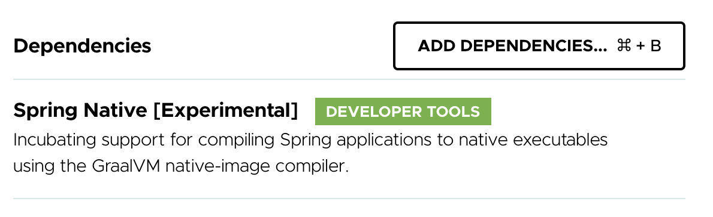

# Spring Nativeで<br/>Spring Bootアプリケーションを<br/>超高速起動

---

## 概要

Javaで作られたWebアプリケーションの起動って遅いですよね。
Hello, world!を返すコントローラーだけを含んだSpring Bootアプリケーションでも起動に1、2秒かかったりしますので、たくさんの機能を有する業務アプリケーションだと言わずもがなですよね。
そんなスロースターターなSpring Bootアプリケーションをネイティブビルドして超高速起動するアプリケーションにしてみましょう。

---

<!--
_class: lead
-->

# Spring Nativeとは

---

## Spring Native概要

- GraalVMネイティブイメージコンパイラを利用してSpringアプリケーションを実行可能ファイルにコンパイルするためのサポートを提供
- GraalVMとはJDKディストリビューションの1つで、JavaScriptやRuby、Pythonといったプログラミング言語で書かれたコードを実行できるようになっているすごいやつ
- GraalVMネイティブイメージコンパイラとはJavaコードをスタンドアローンな実行可能ファイルにコンパイルするすごいやつ

---

## Spring Nativeを使うには

Spring InitializrでSpring NativeをDependenciesに加えてあげればよい。



---

<!--
_class: lead
-->

# 試してみた

---

## 試行の概要

実際に仕事で扱うプロジェクトに少しでも似せるため次のようにした。

- Spring WebMVC + Spring Data JPA (PostgreSQL)でREST APIを構築
- Controller、Service、Repository、Entityを持つトラディショナルなCRUDを100組用意した
- つまりメインクラスと合わせて401クラスを含むプロジェクト
- これに通常のコンパイルとネイティブコンパイルの両方を行なって得たアーティファクトの起動時間を比べてみる

---

## 通常のコンパイル

実行可能JARが生成されるので`java`コマンドで起動する。

```
java -jar target/demo-0.0.1-SNAPSHOT.jar
```

起動時間は次の通り。

```
Started DemoApplication in 6.042 seconds (JVM running for 6.495)
```

---

## ネイティブコンパイル

実行可能ファイルが生成されるので、それを実行する。

```
./target/demo
```

起動時間は次の通り。

```
Started DemoApplication in 0.789 seconds (JVM running for 0.791)
```

---

## 起動時間の比較

ネイティブコンパイル版(下)はとてつもなく速い。

```
Started DemoApplication in 6.042 seconds (JVM running for 6.495)
```

```
Started DemoApplication in 0.789 seconds (JVM running for 0.791)
```

これで超高速起動するSpring Bootアプリケーションが手に入った！

---

<!--
_class: lead
-->

# 課題

---

## 課題

- 制約があるため今すでにあるSpring Bootアプリケーションがそのままネイティブコンパイルできるとは限らない
    - 例えばMyBatisのネイティブコンパイルはサポートされていない
    - リフレクションを使っていたりクラスパスからリソースを読み込んでいる場合、アノテーションで付加情報を書かないといけないかもしれない
- JVMで動くわけではないのでエラー発生時の調査などで従来の調査手法が使えない
- 起動はめちゃくちゃ速いけれど、コンパイルがめちゃくちゃ遅い

---

## 通常のコンパイル速度

前述したプロジェクトで実行可能JARを生成する通常のコンパイルにかかる時間は次の通り。

```
[INFO] ------------------------------------------------------------------------
[INFO] BUILD SUCCESS
[INFO] ------------------------------------------------------------------------
[INFO] Total time:  4.604 s
```

---

## ネイティブコンパイルの速度

一方、ネイティブコンパイルにかかる時間は次の通り。

```
[INFO] ------------------------------------------------------------------------
[INFO] BUILD SUCCESS
[INFO] ------------------------------------------------------------------------
[INFO] Total time:  04:00 min
```

**min!?**

---

## コンパイル時間の比較

ネイティブコンパイル版(下)はとてつもなく遅い。

```
[INFO] ------------------------------------------------------------------------
[INFO] BUILD SUCCESS
[INFO] ------------------------------------------------------------------------
[INFO] Total time:  4.604 s
```

```
[INFO] ------------------------------------------------------------------------
[INFO] BUILD SUCCESS
[INFO] ------------------------------------------------------------------------
[INFO] Total time:  04:00 min
```

---

<!--
_class: lead
-->

## ネイティブコンパイルの使いどころ

---

## ネイティブコンパイルの使いどころ

超高速起動が求められており、基本的なライブラリのみを使い、クラス数が少なく、デバッグしなくてもなんとかなるかもしれない状況が使いどころ(そんなのあるか？)。

※デバッグに関してはネイティブコンパイルしたものに対するデバッグ手法を学ぶべきなんだろうと思う。腰は重いけれど

---

## ネイティブコンパイルの使いどころ

と言うわけでパッと思いつくのはサーバーレス。
高速で起動することがとてもマッチする。
あるいはマイクロサービスもありかも。

あとちょっとしたツール。
ローカルで使うツールはあまりJavaで書く気にはならなかった(JVM起動の「よっこらしょ」感が地味にうっとおしい)。
ネイティブコンパイルすることでスッと起動するツールが作れる。

---

<!--
_class: lead
-->

## まとめ

---

## まとめ

- Javaアプリケーションをネイティブ化できるGraalVMネイティブイメージコンパイラというものがある
- SpringアプリケーションならSpring Nativeを使うとよい
- サーバーレスやマイクロサービスでワンチャンあるかも？
- うらがみさんはまだ自分用のちょっとしたツールぐらいしか使う勇気がない
- よかったらみなさんもネイティブコンパイルして遊びましょう！

以上
