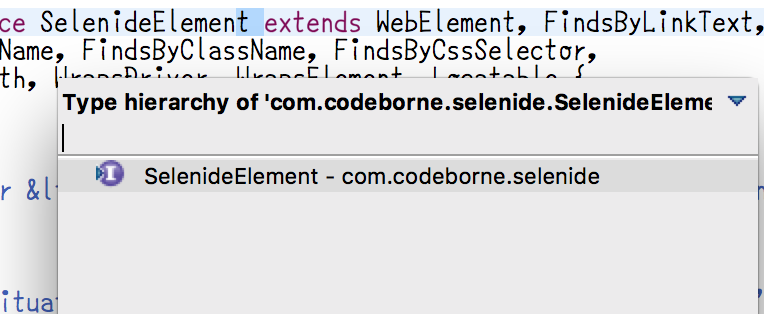
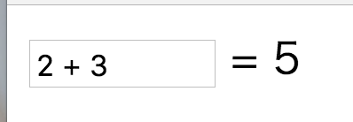
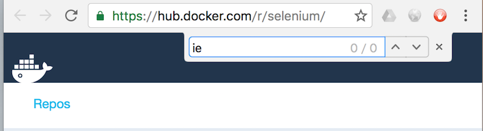
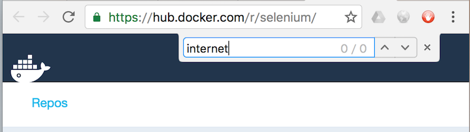

class: center, middle

# Selenideを試行錯誤しながら実践するブラウザ自動テスト

---

### 自己紹介

* うらがみ⛄️
* 大阪でSIerをしているJavaプログラマ

---

class: center, middle

## Selenideってなに？

---

### Selenideとは

* Selenium WebDriverを使いやすくラップしたフレームワーク
* Selenium WebDriverはブラウザのAPIを使ってブラウザを操作できるやつ
* ブラウザ自動テストが出来る

---

### Selenideとは

* 開発元：Codeborne社 (http://codeborne.com)
* 所在地：エストニア共和国 首都タリン
* Selenideの他にPlay Framework関連のコードもある (https://github.com/codeborne)

---

class: center, middle

## Selenium WebDriverとの比較

---

### ページの表示

Selenium WebDriver

```java
WebDriver driver = new ChromeDriver();
driver.navigate().to("http://localhost:3000");
```

---

### ページの表示

Selenide

```java
Selenide.open("http://localhost:3000");
```

---

### ページの表示

`static import`するのが良さそう

```java
open("http://localhost:3000");
```

---

### ページの表示

コードに大して違いはなさそうだけど……

```java
//Selenium WebDriver
WebDriver driver = new ChromeDriver();
driver.navigate().to("http://localhost:3000");

//Selenide
open("http://localhost:3000");
```

---

### ページの表示

ブラウザをChromeからFirefoxに変える

```java
//Selenium WebDriver
WebDriver driver = new FirefoxDriver();
driver.navigate().to("http://localhost:3000");

//Selenide
open("http://localhost:3000");
```

---

### ブラウザの設定

Selenideはシステムプロパティでブラウザを設定

```sh
java -Dbrowser=firefox -cp * \
     org.junit.runner.JUnitCore HogeTest
```

---

### 主な設定項目

|設定項目|プロパティ|デフォルト値|
|---|---|---|
|ブラウザ|`browser`|`firefox`|
|ウィンドウサイズ|`selenide.browser-size`|-|
|最大化するか？|`selenide.start-maximized`|`true`|
|ベースURL|`selenide.baseUrl`|`http://localhost:8080`|
|リモートドライバのURL|`remote`|-|

---

### フォームコントロール

Selenium WebDriver

```java
driver.findElement(By.name("username"))
      .sendKeys("backpaper0");
driver.findElement(By.name("login")).click();
```

---

### フォームコントロール

Selenide

```java
$(By.name("username")).val("backpaper0");
$("[name=login]").click();
```

---

### アサーション

Selenium WebDriver

```java
assertThat(
    driver.findElement(By.id("preview")).getText(),
    containsString("hello world"));
```

---

### アサーション

Selenide

```java
$("#preview").shouldBe(text("hello world"));
```

---

### Ajaxのアサーション

Selenium WebDriver

```java
//ボタンを押したらAjaxで画面を書き換える感じの処理
$(By.linkText("プレビュー")).click();

//Ajaxで画面が書き変わる前にコードが実行されてエラー
assertThat(
    driver.findElement(By.id("preview")).getText(),
    containsString("hello world"));
```

---

### Ajaxのアサーション

```java
long timeout = 4000, polling = 100, start = System.currentTimeMillis();
AssertionError error = null;
do {
    try {
        assertThat(driver.findElement(By.id("preview")).getText(),
                containsString("hello world"));
        error = null;
        break;
    } catch (AssertionError e) { error = e; }
    TimeUnit.MILLISECONDS.sleep(polling);
} while (System.currentTimeMillis() - start < timeout);
if (error != null) { throw error; }
```

---

### Ajaxのアサーション

```java
FluentWait<By> wait = new FluentWait<>(By.id("preview"));
wait.withTimeout(4000L, TimeUnit.MILLISECONDS);
wait.pollingEvery(100L, TimeUnit.MILLISECONDS);
wait.until(new Predicate<By>() {
    @Override
    public boolean apply(By input) {
        return driver.findElement(By.id("preview")).getText().contains("hello world");
    }
});
```

---

### Ajaxのアサーション

Selenide

```java
$("#preview").shouldBe(text("hello world"));
```

---

### SelenideElement

* `$`メソッドの戻り値は`SelenideElement`
* `SelenideElement`はdynamic proxy
* リトライ処理は`SelenideElementProxy`にある(`InvocationHandler`実装クラス)
* アサーション処理などは`Command`実装クラスで行われる

---

### 脱線：dynamic proxy

プログラム実行時に動的に作成されるクラス

```java
InvocationHandler handler = (obj, method, args) ->
    System.out.printf("hello world");
Runnable action = (Runnable) Proxy.newProxyInstance(
    getClass().getClassLoader(),
    new Class<?>[] { Runnable.class },
    handler);
action.run(); //hello world
```

---

### 脱線：dynamic proxy

代表的な利用シーン

* AOP
* wrapper

---

### 脱線：dynamic proxy

* `SelenideElement`は`WebElement`や`FindsByLinkText`などのSeleniumが持つインターフェースを`extends`している
* 実装するメソッドは30超
* 全てにリトライのコードを書かないといけない

---

### 脱線：dynamic proxy

```java
class SelenideElementImpl implements SelenideElement {
    WebElement wrapped;
    public void click() {
        do { wrapped.click(); } while (retry);
    }
    public String getText() {
        do { return wrapped.getText(); } while (retry);
    }
    ...
}
```

---

### 脱線：dynamic proxy

```java
class SelenideElementHandler implements InvocationHandler {
    WebElement wrapped;
    public Object invoke(Object proxy, Method method, Object[] args) throws Throwable {
        do {
            return method.invoke(wrapped, args);
        } while (retry);
    }
}
InvocationHandler handler = new SelenideElement(wrapped);
Proxy.newProxyInstance(loader, interfaces, handler);
```

---

### 脱線：dynamic proxy

ただし静的な継承関係が見えなくなるので乱用はダメ



---

### スクリーンショット

Selenium WebDriver

```java
File source = ((TakesScreenshot) driver)
                  .getScreenshotAs(OutputType.FILE);
Path target = Paths.get("/path/to/saved.png");
Files.copy(source.toPath(), target);
```

---

### スクリーンショット

Selenide

```java
//-Dselenide.reports=/path/to/
screenshot("saved");
```

---

### ラジオボタン

Selenium WebDriver

```java
List<WebElement> as = driver.findElements(By.name("hoge"));
for (WebElement a : as) {
    if (Objects.equals(a.getAttribute("value"), "2")) {
        a.click();
    }
}
```

---

### ラジオボタン

Selenide

```java
selectRadio(By.name("hoge"), "2");

//別の書き方
//$("[name=hoge]").selectRadio("2");
```

---

### その他の比較

SelenideのGitHub Wikiを参照

* https://github.com/codeborne/selenide/wiki/Selenide-vs-Selenium

---

class: center, middle

## ページオブジェクトパターン

---

### 例：計算

式を入れたら計算して答えを表示する



---

### 例：こいつに対するテストコード

```java
@Test public void testAdd() {
    $("#src").val("1 + 2");
    $("#dest").should(text("3"));
}
@Test public void testMul() {
    $("#src").val("3 * 4");
    $("#dest").should(text("12"));
}
//減算、除算、剰余算とテストメソッドが続く
```

---

### 例：プロダクションコードの変更

「計算式を入力するフィールドの`id`を`src`から`expr`に変更しました」

「わかりました」

---

### 例：src → expr

```java
@Test public void testAdd() {
    $("#expr").val("1 + 2");
    $("#dest").should(text("3"));
}
@Test public void testMul() {
    $("#expr").val("3 * 4");
    $("#dest").should(text("12"));
}
//減算、除算、剰余算とテストメソッドが続く
```

---

### 例：プロダクションコードの変更

「答えを表示するフィールドの`id`を`dest`から`answer`に変更しました」

「……はい」

---

### 例：dest → answer

```java
@Test public void testAdd() {
    $("#expr").val("1 + 2");
    $("#answer").should(text("3"));
}
@Test public void testMul() {
    $("#expr").val("3 * 4");
    $("#answer").should(text("12"));
}
//減算、除算、剰余算とテストメソッドが続く
```

---

### 例：プロダクションコードの変更

「計算式を入力するフィールドは`id`消したんで`name`で取得するようにしてください」

「……」

---

### 例：id属性 → name属性

```java
@Test public void testAdd() {
    $(By.name("expr")).val("1 + 2");
    $("#answer").should(text("3"));
}
@Test public void testMul() {
    $(By.name("expr")).val("3 * 4");
    $("#answer").should(text("12"));
}
//減算、除算、剰余算とテストメソッドが続く
```

---

### 大量のlookupは修正が大変

例のようにselectorで要素を取得するコードを書いていると、
変更があった時に全部修正しないといけなくて大変。

そこで、ページオブジェクトパターンを用いる。

* http://docs.seleniumhq.org/docs/06_test_design_considerations.jsp#page-object-design-pattern

---

### ページオブジェクトパターンとは

操作対象のページを表す`class`を作成して、

```java
public class CalcPage {
    public CalcPage calc(String expr) {
        $(By.name("expr")).val("3 * 4");
        return this;
    }
    public String getAnswer() {
        return $("#answer").text();
    }
}
```

---

### ページオブジェクトパターンとは

テストでは、その`class`に対して操作を行う。

```java
@Test public void testAdd() {
    page.calc("1 + 2");
    assertEquals("3", page.getAnswer());
}
@Test public void testMul() {
    page.calc("3 * 4");
    assertEquals("12", page.getAnswer());
}
//減算、除算、剰余算とテストメソッドが続く
```

---

### ページオブジェクトパターンとは

こうすることで、プロダクションコードの影響をページオブジェクト内に限定することができる。

```java
public class CalcPage {
    public CalcPage calc(String expr) {
        //この辺を修正するだけ
        return this;
    }
}
```

---

### 厳密なページオブジェクトパターンの定義

* 内部状態を露出してはいけない
* メソッドでページに対する操作を提供
* メソッドはページオブジェクトを返す
* アサーションは分離する

---

### CalcPage再掲

```java
public class CalcPage {
    public CalcPage calc(String expr) {
        $(By.name("expr")).val("3 * 4");
        return this;
    }
    public String getAnswer() {
        return $("#answer").text();
    }
}
```

---

### ゆるいCalcPage

```java
public class CalcPage {

    public SelenideElement expr
        = $(By.name("expr"));

    public SelenideElement answer
        = $("#answer");
}
```

---

### テストコード例

```java
@Test public void testAdd() {
    page.expr.val("1 + 2");
    page.answer.should(text("3"));
}
@Test public void testMul() {
    page.expr.val("3 * 4");
    page.answer.should(text("12"));
}
//減算、除算、剰余算とテストメソッドが続く
```

---

### ページオブジェクト支援機能

これが、

```java
public class CalcPage {

    public SelenideElement expr
        = $(By.name("expr"));

    public SelenideElement answer
        = $("#answer");
}
```

---

### Selenideのページオブジェクト支援機能

こう書ける。

```java
public class CalcPage {

    @FindBy(name = "expr")
    public SelenideElement expr;

    @FindBy(id = "answer")
    public SelenideElement answer;
}
```

---

### Selenideのページオブジェクト支援機能

こう使う。

```java
CalcPage page = open("http://calc.com", CalcPage.class);
```

---

### しかしSelenideの見解は……

"Classic Page Object"と位置付けて、
欠点があるけどサポートはするよ！ぐらいの雰囲気。

* http://selenide.org/documentation/page-objects.html#classic-page-object

---

### CalcPage再掲

`SelenideElement`をインジェクションしているが、

```java
public class CalcPage {

    @FindBy(name = "expr")
    public SelenideElement expr;

    @FindBy(id = "answer")
    public SelenideElement answer;
}
```

---

### CalcPage再掲

独自クラスをインジェクションすることもできる。

```java
public class CalcPage {

    @FindBy(name = "expr")
    public OrenoExpr expr;

    @FindBy(id = "answer")
    public OrenoAnswer answer;
}
```

---

### 独自クラスの作り方

`ElementsContainer`を`extends`するだけ。

```java
public class OrenoAnswer extends ElementsContainer {
    public void is(String expected) {
        getSelf().should(text(expected));
    }
}
```

---

### 独自クラスの作り方

`SelenideElement`よりも具体的な`class`で扱える。

```java
@Test public void testAdd() {
    page.expr.val("1 + 2");
    page.answer.is("3");
}
@Test public void testMul() {
    page.expr.val("3 * 4");
    page.answer.is("12");
}
//減算、除算、剰余算とテストメソッドが続く
```

---

### 独自クラスの作り方

あと`ElementsContainer`を使うとインジェクションを入れ子にできる。

```java
public class OrenoElement extends ElementsContainer {
    @FindBy(name = "hoge")
    public SelenideElement hoge;
}
```

---

### 独自クラスの作り方

ページオブジェクトはこんな感じ。

```java
public class FooBarPage {
    @FindBy(id = "foo")
    public OrenoElement foo;
    @FindBy(id = "bar")
    public OrenoElement bar;
}
```

---

### 独自クラスの作り方

こんなHTMLから作られるページをマッピングできる。

```html
<p id="foo">
    <input type="text" name="hoge">
</p>
<p id="bar">
    <input type="text" name="hoge">
</p>
```

---

class: center, middle

## デモ

---

### デモ

Redmineを利用したSelenideのデモ

* https://github.com/backpaper0/selenide-demo

---

### テストケース

* Redmineの初期設定〜プロジェクトの作成
* チケットの登録
* チケットへのファイル添付
* チケットの削除(`confirm`ダイアログ)

---

class: center, middle

### デモ実施

---

### headlessでテストしたい

`PhantomJSDriver`とか`HtmlUnitDriver`を使う、のではなく`RemoteWebDriver`とDockerを使うのが良さそう。
（Selenium Server + Xvfb）

💻　➡︎　🐳　➡︎　Redmine

SeleniumがDockerイメージを提供している。

* https://hub.docker.com/r/selenium/

---

### Docker上でリモートサーバを立てる

そのまま使うと日本語が表示できないので、フォントを準備したイメージを作っておく。

```none
# Dockerfile
FROM selenium/standalone-chrome

RUN sudo apt-get update && \
    sudo apt-get install -y fonts-ipafont
```

---

### Docker上でリモートサーバを立てる

日本語フォント入りイメージをビルドして、

```sh
docker build -t backpaper0/standalone-chrome .
```

それを使ってサーバを立てる。

```sh
docker run -d -p 4444:4444 backpaper0/standalone-chrome
```

---

### Selenide使ってRemoteWebDriverでテスト

ローカルでのテスト実行コマンド。

```sh
java -Dselenide.baseUrl=http://myredmine:3000 \
     -Dbrowser=chrome \
     -Dwebdriver.chrome.driver=chromedriver \
     ...
```

---

### Selenide使ってRemoteWebDriverでテスト

リモートでのテスト実行コマンド。

```sh
java -Dselenide.baseUrl=http://myredmine:3000 \
     -Dbrowser=chrome \
     -Dremote=http://localhost:4444/wd/hub \
     ...
```

---

class: center, middle

### デモ実施

---

class: center, middle

## 困っていること

---

### IE👿

お客様の標準ブラウザ、それはIE。

---

### IE👿



---

### IE👿



---

### Dockerでheadless実行したい……

何か良い方法があったら教えてください。

---

### その他のIEのつらみ

* 64bitドライバの動作が死ぬほど遅い（32bitドライバを使って解決😇）
* modal dialogとiframeの組み合わせで死ぬほど遅くなる気が……？（未検証）
* たまに予期せぬエラーで落ちる

---

class: center, middle

## まとめ

---

## この資料について

* Author: [@backpaper0](https://github.com/backpaper0)
* License:  [The MIT License](https://opensource.org/licenses/MIT)

