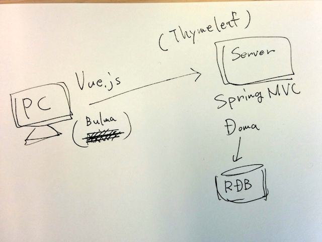
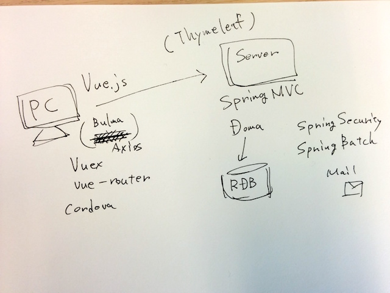
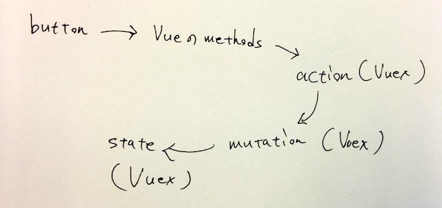

class: center, middle

# Vue入門

### Javaしか出来ないSIerがVueやってみた

---

### 自己紹介

* うらがみ⛄️
* 大阪でSIerをしているJavaプログラマ
* 得意なのはサーバサイドJava
* JavaScriptの知識はjQueryで止まってた

---

### 発表概要

* （うらがみが）Vue入門（した話）
* サーバサイドJavaプログラマのみなさんがVueに手を出すきっかけになれますように
* （ただ、JavaScriptの体系的な正しい知識は無いので、そこはお許しを）

---

### 今日する話

* VueでHello, world!
* サンプルのデモ
* npmとかwebpackを使った感想
* VueでSPA作るときの道具について
* 余談

---

### 今日しない話

* JavaScript自体の説明

---

### Hello, world!

```html
<script src="https://unpkg.com/vue@2.1.10/dist/vue.js"></script>
<div id="app">
  <input v-model="yourName">
  <span>Hello, {{ yourName }}!</span>
</div>
<script>
new Vue({
  'el': '#app',
  data: { yourName: 'world' }
})
</script>
```

---

### Hello, world!の簡単な解説

```html
<script src="https://unpkg.com/vue@2.1.10/dist/vue.js"></script>
<div id="app">
  <input v-model="yourName"><!-- v-modelで双方向バインド -->
  <span>Hello, {{ yourName }}!</span><!-- 二重波括弧で出力 -->
</div>
<script>
new Vue({
  'el': '#app', //idがappの要素にマウントする
  data: { yourName: 'world' } //双方向バインドされるデータ
})
</script>
```

---

### もうちょいちゃんとしたサンプル

https://github.com/backpaper0/memo-sample

※このサンプルではnpmもwebpackも使わずにscript要素で読み込んでいます

---

### サンプルの構成



---

class: center, middle

## サンプルのデモ

---

### ちなみに今やってるやつの構成



---

### Cordova使ってるサンプルもあった

https://github.com/backpaper0/cordova-vue-sample

---

### Vueを選んだ理由

* Vueが一番簡単に見えていた（Vue|React|Angular）
* script要素でvue.jsを読み込んで`new Vue()`すれば良いだけ
* 学習コストは低い方が嬉しい（結局npmとかwebpackを導入したけども）

---

### npmとwebpackの導入

* 最初はscript要素をずらーっと書くつもりだった
* でもnpmとwebpackを使う方法しか見つけられなかった（いろいろと理解が進んでscript要素でいけるようになったけども）
* もはやnpmとwebpackを使わない方が（情報を探すのが）難しい

---

### npmを使ってみて

* 依存関係の管理が楽
* MavenやGradleを使っている身としては、そこに違和感はない
* ただ、`node_modules`ディレクトリに全部持ってくるのはやめてほしい

---

### webpackを使ってみて

* CSSやフォントもまとめられるのが面白い
* style要素を差し込んだり、data URIでフォントをロードしたり、バイトコードエンハンス系の味わい深さを感じる
* xxx-loaderを読めばどんなまとめられ方してるか分かる
* webpack dev serverが便利すぎてわろてる
* webpack dev serverとSpring Boot Developer toolsでhotreloadingな開発

---

### SPAを導入した理由

* モバイルアプリっぽさの演出
* ページ切り替えをスムーズに行いたい
* あとは単純にやってみたかった

---

### SPAの良さ

* ルーティング + Ajax
* バリデーション系の楽さが顕著（SPAっていうかAjax）
* というかページ全体submitのイケてなさ（エラー情報も含んだページを返す必要がある）
* ページをまたいで状態を保持できるのが楽

---

### SPAを支えるもの

* vue-router
* Vuex

---

### vue-router

Vue.jsでルーティングするためのプラグイン

```js
import Home from './Home.vue'
import Hello from './Hello.vue'

Vue.use(VueRouter)

const router = new VueRouter({
  routes: [
     { path: '/', component: Home }
    ,{ path: '/hello', component: Hello }
  ]
})
```

---

### vue-router

```js
new Vue({
  methods: {
    sayHello () {
      //ページをHelloに切り替える
      this.$router.push('/hello')
    }
  }
})
```

---

### Vuex

Vueで使いやすいFlux実装

* Flux　←　Facebookが提唱した概念
* Redux　←　Facebookが作ったFlux実装
* Vuex　←　Vue向けのFlux実装

---

### Vuexの登場人物

* state
* mutation
* action

---

### Vuexの登場人物

* state　←　状態
* mutation　←　状態を直接更新する
* action　←　mutationを呼び出す

---

### 例

```html
<button @click="save">Save</button>
```

---

### 例

```js
new Vue({
  methods: {
    save () {
      this.$store.dispatch('save', this.message)
    }
  },
  ...
```

---

### 例

```js
const actions = {
  save: ({ commit }, message) => {
    commit('setMessage', message)
  }
}
```

---

### 例

```js
const mutations = {
  setMessage: (state, message) => {
    state.message = message
  }
}
```

---

### 例

```js
const state = {
  message: ''
}

new Vuex.Store({
  state,
  mutations,
  actions
})
```

---

### 例



サーバサイドJavaっぽさを感じる

---

### サーバサイドJavaっぽく見たVuex

* state　←　RDB
* mutation　←　Repository、Dao
* action　←　Service

※Controllerに当たるものはVueのmethodsなど

---

### 余談

Javaっぽく見るとjQueryと(Knockout|)Vue（つまりバインディング系のフレームワーク）の対比は、
LookupとInjectの対比に似ていると思う

---

### 余談

```html
<button id="countUp">Count up</button>
<p id="counter">0</p>
```

```js
let count = 0
$('#countUp').on('click', () => {
  $('#counter').text(++count)
})
```
JavaScriptコードで`#counter`をtypoしていてもCount upボタンを押すまでエラーにならない

---

### 余談

```html
<button @click="countUp">Count up</button>
<p>{{ count }}</p>
```

```js
new Vue({
  data: { count: 0 },
  methods: { countUp () {
      this.count++
}}})
```

HTMLテンプレートで`countUp`をtypoしていたら`Vue`のインスタンス化時にエラーになる

---

### 余談

```java
void countUp() {
  CounterService service = CDI.current()
    .select(CounterService.class).get();
  service.increment();
}
```

`CounterService`がコンテナで管理されていなくても、
このコードを実行するまで例外にならない

---

### 余談

```java
@Inject
CounterService service;

void countUp() {
  service.increment();
}
```

`CounterService`がコンテナで管理されていない場合は、
コンテナ起動時に例外になる

余談おわり

---

class: center, middle

## まとめと思うこと

---

### まとめ

* Vue + Vuex + vue-routerはコンポーネントと多層なコードでJavaっぽい
* npmはMavenとかGradleっぽい
* webpackは要するに`javac`して`jar -cf hoge.jar .`みたいなこと

※個人の感想

---

### 思うこと

* これまでフロントエンジニアの皆さんが頑張ってくれて、
  現在は入門しやすい状態になっている印象
* SPAは業務アプリに向いてると思う
* 余談にも書いたけどLookupよりもInjectを選ぶ
* あと、書いてないけどObserver Patternは最高のデザインパターン
  （双方向バインディング、`Promise`、リアクティブ、MSAにおけるコレオグラフィ）

---

## この資料について

* Author: [@backpaper0](https://github.com/backpaper0)
* License:  [The MIT License](https://opensource.org/licenses/MIT)
